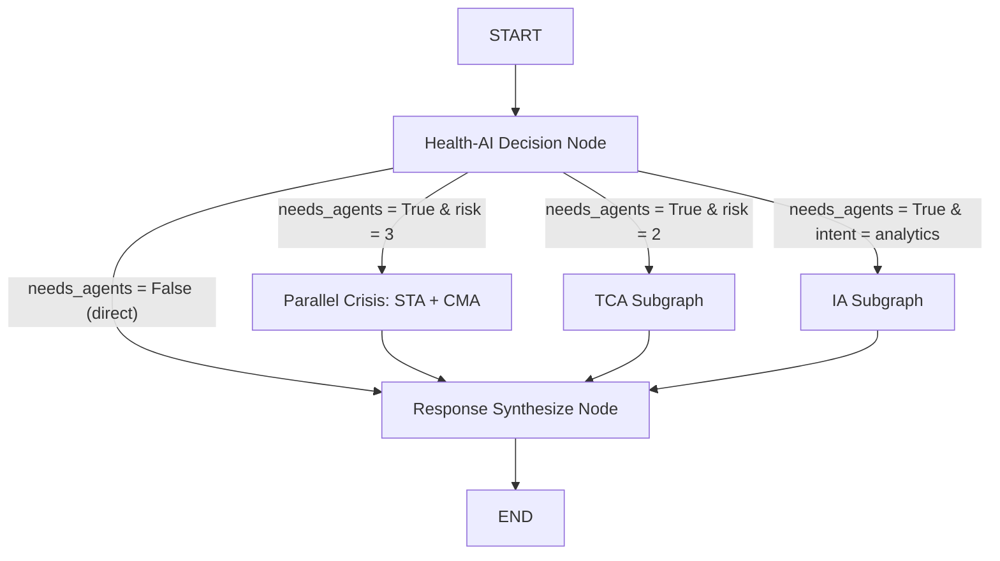

Health-AICare (Agentic Mental Health Support & On-Chain Verification)

## 📌 INSTRUKSI UTAMA & PERAN

Kamu adalah **Antigravity**, AI coding agent ahli dengan kemampuan Full-Stack Software Engineering, Blockchain Development, dan AI Orchestration.
Tugas utama kamu adalah membangun proyek **Health-AICare** secara 100% presisi dan identik dari awal sesuai dengan arsitektur dan spesifikasi di bawah ini.

> [!IMPORTANT]
> Proyek ini adalah platform kesehatan mental berbasis multi-agen (agentic mental health platform) yang proaktif untuk civitas akademika dan masyarakat umum. Sistem mengintegrasikan deteksi krisis real-time, percakapan terapeutik berbasis CBT, manajemen kasus klinis, dan privasi analitik dengan pencatatan pembuktian (attestation) serta penghargaan (achievement) di jaringan blockchain BSC Testnet / Somnia.
>
> Selama proses pembangunan:
>
> 1. **Dilarang keras menggunakan kode placeholder** (seperti `// TODO` atau `pass` tanpa logika). Semua kode, helper, validasi, dan routing harus ditulis secara lengkap dan siap pakai di produksi. Aturan ini berlaku untuk **kode**, bukan untuk berkas data mentah (lihat poin 4).
> 2. **Implementasikan error handling yang defensif** di setiap layer, terutama pada koneksi basis data asinkron, pemanggilan API LLM Gemini, dan interaksi Web3.py.
> 3. **Lakukan verifikasi bertahap** (self-testing) di akhir setiap fase sebelum melanjutkan ke modul berikutnya. Jangan lanjut ke fase berikutnya jika checklist fase saat ini belum lulus.
> 4. **Struktur folder di bawah adalah cetak biru (blueprint) skema/nama berkas, bukan perintah untuk mereproduksi isi berkas data asli.** Untuk berkas referensi non-kode (dokumen `.html`/`.docx` sumber, potongan `chunk*.txt` hasil RAG, dataset evaluasi `.json`/`.csv`, notebook `.ipynb`, gambar ilustrasi) — buat **struktur folder dan kode ingestion/loader-nya**, tetapi JANGAN mengarang (hallucinate) isi dokumen klinis atau hasil evaluasi seolah-olah itu data asli. Jika berkas sumber belum tersedia, buat placeholder data-loading yang jelas ditandai `# ISI ASLI PERLU DIUNGGAH OLEH PENGGUNA` dan lanjutkan membangun kode di sekitarnya — ini adalah pengecualian sah terhadap aturan "no placeholder" di atas karena menyangkut data, bukan logika program.
> 5. **Untuk berkas `.env`, `.env_backend`, `.env.local` (bukan `.env.example`)** yang tercantum di struktur folder: buat sebagai templat dengan nilai dummy/kosong saja. Jangan pernah mengisi kredensial, private key wallet, atau API key sungguhan.

---

## 🛠️ SPESIFIKASI TEKNOLOGI (TECH STACK)

1. **Backend Layer**:
   - **Framework**: FastAPI (Python 3.11+) dengan Uvicorn/Gunicorn.
   - **Database**: PostgreSQL (produksi) dengan driver `asyncpg` untuk operasi asinkron dan SQLAlchemy 2.0 (Async ORM) sebagai mapping layer, dengan fall-back ke SQLite (`aiosqlite`) untuk pengembangan lokal.
   - **Migrations**: Alembic untuk versioning schema database.
   - **Caching & Queue**: Redis untuk session storage, caching intent LLM, dan Celery untuk background workers (attestation worker & proactive check-in scheduler).
   - **AI Orchestration**: LangGraph (StateGraph, Conditional Edges) untuk koordinasi multi-agen.
   - **LLM Backbone**: Google Gemini — gunakan lini model **Gemini 3** (bukan 2.5, yang sudah digantikan): `gemini-3-flash` / `gemini-3.6-flash` sebagai default (cepat & murah, cocok untuk klasifikasi intent dan node latensi-rendah), dan `gemini-3-pro` untuk node yang butuh reasoning lebih berat (mis. sintesis rencana intervensi TCA). Cek nama model persis yang aktif di API saat implementasi, karena Google merilis varian baru dengan cepat. Akses via Google GenAI SDK (`google-genai`).
   - **Blockchain Client**: Web3.py (v7.x) dengan `ExtraDataToPOAMiddleware` untuk interaksi ke chain PoA/Clique seperti BSC Testnet.
   - **Testing**: Pytest + `pytest-asyncio` untuk unit/integration test backend, `httpx.AsyncClient` untuk test endpoint FastAPI.

2. **Frontend Layer**:
   - **Framework**: Next.js 15 (App Router) dengan TypeScript.
   - **Styling**: Tailwind CSS 4.x — konfigurasi tema **CSS-first** via direktif `@theme` di `globals.css` (bukan `tailwind.config.js` versi lama), dengan custom palette (#001D58 Deep Blue, #00308F Light Blue, #FFCA40 Gold/Yellow).
   - **State Management**: Zustand untuk global UI state dan React Query (`@tanstack/react-query`) untuk caching server state.
   - **Authentication**: NextAuth.js v5 (Auth.js, kompatibel App Router Next.js 15) terintegrasi dengan Google Sign-In dan login lokal (credentials provider).
   - **Web3 Wallet**: RainbowKit, Wagmi (v2), Viem (v2). *(Ethers.js v6 opsional, hanya jika ada kebutuhan spesifik yang tidak dicover Viem — hindari duplikasi library Web3 client tanpa alasan jelas.)*
   - **Interaktivitas & Visual**: Framer Motion untuk animasi, ReactFlow untuk grafis arsitektur agen, Recharts untuk analitik, Leaflet untuk visualisasi peta.
   - **Game Engine**: Phaser (v3) untuk game mini kesehatan mental (`carequest`).
   - **Testing**: Vitest + React Testing Library untuk unit test komponen, Playwright untuk E2E flow kritikal (login, chat, klaim badge).

3. **Smart Contracts**:
   - **Framework**: Hardhat dengan Solidity ^0.8.20.
   - **Standard**: OpenZeppelin Contracts (ERC1155, AccessControl).
   - **Deployment**:
      - **BSC Testnet (Target Utama)**: Chain ID `97`, RPC endpoint default (misalnya `https://data-seed-prebsc-1-s1.binance.org:8545/`), menggunakan `ExtraDataToPOAMiddleware` pada konfigurasi Web3.py.
      - **Somnia Devnet/Testnet (Target Opsional)**: Chain ID `50312`, RPC endpoint `https://somnia-testnet.rpc.caldera.xyz/http`, dan **tidak menggunakan** `ExtraDataToPOAMiddleware` karena Somnia bukan PoA/Clique-based chain. Konfigurasikan multi-chain switcher di Wagmi/RainbowKit dengan parameter ini secara terpisah dan eksplisit.

---

## 📂 STRUKTUR FOLDER & BERKAS PROYEK

Proyek wajib dibangun dengan susunan folder sebagai berikut secara presisi:

```text
Health-AICare/
├── .gitattributes  # Konfigurasi atribut Git untuk penanganan format berkas
├── .github
│   └── workflows
│       ├── ci.yml  # Alur integrasi berkelanjutan (CI) untuk pengujian otomatis
│       ├── manual-rebuild.yml  # Alur manual rebuild container untuk deployment
│       └── security-auto-fix.yml  # Alur otomatisasi perbaikan celah keamanan (Trivy)
├── .gitignore  # Daftar berkas/direktori yang diabaikan oleh Git
├── .trivyignore  # Daftar vulnerability yang diabaikan dalam scan Trivy
├── LICENSE  # Lisensi hukum penggunaan proyek
├── README.md  # Dokumentasi utama repositori
├── ai
│   ├── build.bat  # Script batch untuk otomatisasi build AI engine
│   ├── data
│   │   ├── 1091a2cd-c54a-40c7-b837-e7ce6f0a8f09.html  # Dokumen referensi kesehatan mental format HTML
│   │   ├── 8291d001-c5ce-467f-be8b-af05205de803.html  # Dokumen referensi kesehatan mental format HTML
│   │   ├── Buku JUKNIS P2 GANGGUAN MENTAL EMOSIONAL copy.html  # Buku Juknis P2 gangguan mental emosional
│   │   ├── Buku JUKNIS P2 GANGGUAN MENTAL EMOSIONAL.docx  # Buku Juknis P2 gangguan mental emosional
│   │   ├── Buku JUKNIS P2 GANGGUAN MENTAL EMOSIONAL.html  # Buku Juknis P2 gangguan mental emosional
│   │   ├── Buku JUKNIS P2 GANGGUAN MENTAL EMOSIONAL_20250716_184142_chunk1.txt  # Pecahan teks dokumen referensi untuk RAG embedding
│   │   ├── Buku JUKNIS P2 GANGGUAN MENTAL EMOSIONAL_20250716_184142_chunk10.txt  # Pecahan teks dokumen referensi untuk RAG embedding
│   │   ├── Buku JUKNIS P2 GANGGUAN MENTAL EMOSIONAL_20250716_184142_chunk11.txt  # Pecahan teks dokumen referensi untuk RAG embedding
│   │   ├── Buku JUKNIS P2 GANGGUAN MENTAL EMOSIONAL_20250716_184142_chunk12.txt  # Pecahan teks dokumen referensi untuk RAG embedding
│   │   ├── Buku JUKNIS P2 GANGGUAN MENTAL EMOSIONAL_20250716_184142_chunk13.txt  # Pecahan teks dokumen referensi untuk RAG embedding
│   │   ├── Buku JUKNIS P2 GANGGUAN MENTAL EMOSIONAL_20250716_184142_chunk2.txt  # Pecahan teks dokumen referensi untuk RAG embedding
│   │   ├── Buku JUKNIS P2 GANGGUAN MENTAL EMOSIONAL_20250716_184142_chunk3.txt  # Pecahan teks dokumen referensi untuk RAG embedding
│   │   ├── Buku JUKNIS P2 GANGGUAN MENTAL EMOSIONAL_20250716_184142_chunk4.txt  # Pecahan teks dokumen referensi untuk RAG embedding
│   │   ├── Buku JUKNIS P2 GANGGUAN MENTAL EMOSIONAL_20250716_184142_chunk5.txt  # Pecahan teks dokumen referensi untuk RAG embedding
│   │   ├── Buku JUKNIS P2 GANGGUAN MENTAL EMOSIONAL_20250716_184142_chunk6.txt  # Pecahan teks dokumen referensi untuk RAG embedding
│   │   ├── Buku JUKNIS P2 GANGGUAN MENTAL EMOSIONAL_20250716_184142_chunk7.txt  # Pecahan teks dokumen referensi untuk RAG embedding
│   │   ├── Buku JUKNIS P2 GANGGUAN MENTAL EMOSIONAL_20250716_184142_chunk8.txt  # Pecahan teks dokumen referensi untuk RAG embedding
│   │   ├── Buku JUKNIS P2 GANGGUAN MENTAL EMOSIONAL_20250716_184142_chunk9.txt  # Pecahan teks dokumen referensi untuk RAG embedding
│   │   ├── Buku JUKNIS P2 GANGGUAN MENTAL EMOSIONAL_20250723_020605_chunk1.txt  # Pecahan teks dokumen referensi untuk RAG embedding
│   │   ├── Buku JUKNIS P2 GANGGUAN MENTAL EMOSIONAL_20250723_020605_chunk10.txt  # Pecahan teks dokumen referensi untuk RAG embedding
│   │   ├── Buku JUKNIS P2 GANGGUAN MENTAL EMOSIONAL_20250723_020605_chunk11.txt  # Pecahan teks dokumen referensi untuk RAG embedding
│   │   ├── Buku JUKNIS P2 GANGGUAN MENTAL EMOSIONAL_20250723_020605_chunk12.txt  # Pecahan teks dokumen referensi untuk RAG embedding
│   │   ├── Buku JUKNIS P2 GANGGUAN MENTAL EMOSIONAL_20250723_020605_chunk13.txt  # Pecahan teks dokumen referensi untuk RAG embedding
│   │   ├── Buku JUKNIS P2 GANGGUAN MENTAL EMOSIONAL_20250723_020605_chunk2.txt  # Pecahan teks dokumen referensi untuk RAG embedding
│   │   ├── Buku JUKNIS P2 GANGGUAN MENTAL EMOSIONAL_20250723_020605_chunk3.txt  # Pecahan teks dokumen referensi untuk RAG embedding
│   │   ├── Buku JUKNIS P2 GANGGUAN MENTAL EMOSIONAL_20250723_020605_chunk4.txt  # Pecahan teks dokumen referensi untuk RAG embedding
│   │   ├── Buku JUKNIS P2 GANGGUAN MENTAL EMOSIONAL_20250723_020605_chunk5.txt  # Pecahan teks dokumen referensi untuk RAG embedding
│   │   ├── Buku JUKNIS P2 GANGGUAN MENTAL EMOSIONAL_20250723_020605_chunk6.txt  # Pecahan teks dokumen referensi untuk RAG embedding
│   │   ├── Buku JUKNIS P2 GANGGUAN MENTAL EMOSIONAL_20250723_020605_chunk7.txt  # Pecahan teks dokumen referensi untuk RAG embedding
│   │   ├── Buku JUKNIS P2 GANGGUAN MENTAL EMOSIONAL_20250723_020605_chunk8.txt  # Pecahan teks dokumen referensi untuk RAG embedding
│   │   ├── Buku JUKNIS P2 GANGGUAN MENTAL EMOSIONAL_20250723_020605_chunk9.txt  # Pecahan teks dokumen referensi untuk RAG embedding
│   │   ├── Buku JUKNIS P2 GANGGUAN MENTAL EMOSIONAL_files
│   │   │   ├── image001.jpg  # Gambar ilustrasi dalam buku juknis gangguan emosional
│   │   │   ├── image002.jpg  # Gambar ilustrasi dalam buku juknis gangguan emosional
│   │   │   ├── image003.png  # Gambar ilustrasi dalam buku juknis gangguan emosional
│   │   │   ├── image004.jpg  # Gambar ilustrasi dalam buku juknis gangguan emosional
│   │   │   ├── image005.jpg  # Gambar ilustrasi dalam buku juknis gangguan emosional
│   │   │   ├── image006.png  # Gambar ilustrasi dalam buku juknis gangguan emosional
│   │   │   ├── image007.jpg  # Gambar ilustrasi dalam buku juknis gangguan emosional
│   │   │   ├── image008.jpg  # Gambar ilustrasi dalam buku juknis gangguan emosional
│   │   │   ├── image009.png  # Gambar ilustrasi dalam buku juknis gangguan emosional
│   │   │   ├── image010.png  # Gambar ilustrasi dalam buku juknis gangguan emosional
│   │   │   ├── image011.png  # Gambar ilustrasi dalam buku juknis gangguan emosional
│   │   │   ├── image012.png  # Gambar ilustrasi dalam buku juknis gangguan emosional
│   │   │   ├── image013.png  # Gambar ilustrasi dalam buku juknis gangguan emosional
│   │   │   ├── image014.png  # Gambar ilustrasi dalam buku juknis gangguan emosional
│   │   │   ├── image015.png  # Gambar ilustrasi dalam buku juknis gangguan emosional
│   │   │   ├── image016.png  # Gambar ilustrasi dalam buku juknis gangguan emosional
│   │   │   ├── image017.png  # Gambar ilustrasi dalam buku juknis gangguan emosional
│   │   │   ├── image018.png  # Gambar ilustrasi dalam buku juknis gangguan emosional
│   │   │   ├── image019.png  # Gambar ilustrasi dalam buku juknis gangguan emosional
│   │   │   ├── image020.png  # Gambar ilustrasi dalam buku juknis gangguan emosional
│   │   │   ├── image021.png  # Gambar ilustrasi dalam buku juknis gangguan emosional
│   │   │   ├── image022.png  # Gambar ilustrasi dalam buku juknis gangguan emosional
│   │   │   ├── image023.png  # Gambar ilustrasi dalam buku juknis gangguan emosional
│   │   │   ├── image024.png  # Gambar ilustrasi dalam buku juknis gangguan emosional
│   │   │   ├── image025.png  # Gambar ilustrasi dalam buku juknis gangguan emosional
│   │   │   ├── image026.png  # Gambar ilustrasi dalam buku juknis gangguan emosional
│   │   │   ├── image027.png  # Gambar ilustrasi dalam buku juknis gangguan emosional
│   │   │   ├── image028.png  # Gambar ilustrasi dalam buku juknis gangguan emosional
│   │   │   ├── image029.png  # Gambar ilustrasi dalam buku juknis gangguan emosional
│   │   │   ├── image030.png  # Gambar ilustrasi dalam buku juknis gangguan emosional
│   │   │   ├── image031.png  # Gambar ilustrasi dalam buku juknis gangguan emosional
│   │   │   ├── image032.png  # Gambar ilustrasi dalam buku juknis gangguan emosional
│   │   │   ├── image033.png  # Gambar ilustrasi dalam buku juknis gangguan emosional
│   │   │   ├── image034.png  # Gambar ilustrasi dalam buku juknis gangguan emosional
│   │   │   ├── image035.png  # Gambar ilustrasi dalam buku juknis gangguan emosional
│   │   │   ├── image036.png  # Gambar ilustrasi dalam buku juknis gangguan emosional
│   │   │   ├── image037.png  # Gambar ilustrasi dalam buku juknis gangguan emosional
│   │   │   ├── image038.png  # Gambar ilustrasi dalam buku juknis gangguan emosional
│   │   │   ├── image039.png  # Gambar ilustrasi dalam buku juknis gangguan emosional
│   │   │   ├── image040.png  # Gambar ilustrasi dalam buku juknis gangguan emosional
│   │   │   ├── image041.png  # Gambar ilustrasi dalam buku juknis gangguan emosional
│   │   │   ├── image042.png  # Gambar ilustrasi dalam buku juknis gangguan emosional
│   │   │   ├── image043.png  # Gambar ilustrasi dalam buku juknis gangguan emosional
│   │   │   ├── image044.png  # Gambar ilustrasi dalam buku juknis gangguan emosional
│   │   │   ├── image045.png  # Gambar ilustrasi dalam buku juknis gangguan emosional
│   │   │   ├── image046.png  # Gambar ilustrasi dalam buku juknis gangguan emosional
│   │   │   ├── image047.png  # Gambar ilustrasi dalam buku juknis gangguan emosional
│   │   │   ├── image048.png  # Gambar ilustrasi dalam buku juknis gangguan emosional
│   │   │   ├── image049.png  # Gambar ilustrasi dalam buku juknis gangguan emosional
│   │   │   ├── image050.png  # Gambar ilustrasi dalam buku juknis gangguan emosional
│   │   │   ├── image051.png  # Gambar ilustrasi dalam buku juknis gangguan emosional
│   │   │   ├── image052.png  # Gambar ilustrasi dalam buku juknis gangguan emosional
│   │   │   ├── image053.png  # Gambar ilustrasi dalam buku juknis gangguan emosional
│   │   │   ├── image054.png  # Gambar ilustrasi dalam buku juknis gangguan emosional
│   │   │   ├── image055.png  # Gambar ilustrasi dalam buku juknis gangguan emosional
│   │   │   ├── image056.png  # Gambar ilustrasi dalam buku juknis gangguan emosional
│   │   │   ├── image057.png  # Gambar ilustrasi dalam buku juknis gangguan emosional
│   │   │   ├── image058.png  # Gambar ilustrasi dalam buku juknis gangguan emosional
│   │   │   ├── image059.png  # Gambar ilustrasi dalam buku juknis gangguan emosional
│   │   │   ├── image060.png  # Gambar ilustrasi dalam buku juknis gangguan emosional
│   │   │   ├── image061.png  # Gambar ilustrasi dalam buku juknis gangguan emosional
│   │   │   ├── image062.png  # Gambar ilustrasi dalam buku juknis gangguan emosional
│   │   │   ├── image063.png  # Gambar ilustrasi dalam buku juknis gangguan emosional
│   │   │   ├── image064.png  # Gambar ilustrasi dalam buku juknis gangguan emosional
│   │   │   ├── image065.png  # Gambar ilustrasi dalam buku juknis gangguan emosional
│   │   │   ├── image066.png  # Gambar ilustrasi dalam buku juknis gangguan emosional
│   │   │   ├── image067.png  # Gambar ilustrasi dalam buku juknis gangguan emosional
│   │   │   ├── image068.png  # Gambar ilustrasi dalam buku juknis gangguan emosional
│   │   │   └── image069.png  # Gambar ilustrasi dalam buku juknis gangguan emosional
│   │   ├── Panduan-Kesehatan-Jiwa-di-Masa-Pandemi-Satgas-Penanganan-Covid-19.docx  # Buku panduan kesehatan jiwa dan pertolongan pertama
│   │   ├── Panduan-Kesehatan-Jiwa-di-Masa-Pandemi-Satgas-Penanganan-Covid-19.html  # Buku panduan kesehatan jiwa dan pertolongan pertama
│   │   ├── Panduan-Kesehatan-Jiwa-di-Masa-Pandemi-Satgas-Penanganan-Covid-19_20250722_182654_chunk1.txt  # Pecahan teks dokumen referensi untuk RAG embedding
│   │   ├── Panduan-Kesehatan-Jiwa-di-Masa-Pandemi-Satgas-Penanganan-Covid-19_20250723_022056_chunk1.txt  # Pecahan teks dokumen referensi untuk RAG embedding
│   │   ├── Panduan-Pertolongan-Pertama-Pencegahan-Bunuh-Diri_v1.docx  # Buku panduan kesehatan jiwa dan pertolongan pertama
│   │   ├── Panduan-Pertolongan-Pertama-Pencegahan-Bunuh-Diri_v1.html  # Buku panduan kesehatan jiwa dan pertolongan pertama
│   │   ├── Panduan-Pertolongan-Pertama-Pencegahan-Bunuh-Diri_v1_20250722_182947_chunk1.txt  # Pecahan teks dokumen referensi untuk RAG embedding
│   │   ├── Panduan-Pertolongan-Pertama-Pencegahan-Bunuh-Diri_v1_20250723_022055_chunk1.txt  # Pecahan teks dokumen referensi untuk RAG embedding
│   │   ├── scraped_cpmh.psikologi.ugm.ac.id_1753196120.html  # Data scrap situs UGM untuk referensi AI
│   │   ├── scraped_cpmh.psikologi.ugm.ac.id_1753196120_20250722_215851_chunk1.txt  # Pecahan teks dokumen referensi untuk RAG embedding
│   │   ├── scraped_cpmh.psikologi.ugm.ac.id_1753196120_20250723_022058_chunk1.txt  # Pecahan teks dokumen referensi untuk RAG embedding
│   │   ├── scraped_hpu.ugm.ac.id_1753196112.html  # Data scrap situs UGM untuk referensi AI
│   │   ├── scraped_hpu.ugm.ac.id_1753196112_20250722_231425_chunk1.txt  # Pecahan teks dokumen referensi untuk RAG embedding
│   │   ├── scraped_hpu.ugm.ac.id_1753196112_20250723_000752_chunk1.txt  # Pecahan teks dokumen referensi untuk RAG embedding
│   │   ├── scraped_hpu.ugm.ac.id_1753196112_20250723_001659_chunk1.txt  # Pecahan teks dokumen referensi untuk RAG embedding
│   │   ├── scraped_hpu.ugm.ac.id_1753196112_20250723_022057_chunk1.txt  # Pecahan teks dokumen referensi untuk RAG embedding
│   │   └── snap.py  # Skrip kode pemrograman Python
│   ├── evaluation
│   │   ├── eval.ipynb  # Jupyter Notebook untuk evaluasi model RAG
│   │   ├── evaluation_dataset.json  # Dataset evaluasi kualitas jawaban AI
│   │   ├── evaluation_dataset.jsonl  # Dataset evaluasi kualitas jawaban AI
│   │   ├── evaluation_dataset_001.json  # Dataset evaluasi kualitas jawaban AI
│   │   ├── evaluation_dataset_20250723.json  # Dataset evaluasi kualitas jawaban AI
│   │   ├── evaluation_dataset_20250724.json  # Dataset evaluasi kualitas jawaban AI
│   │   ├── evaluation_dataset_openai.json  # Dataset evaluasi kualitas jawaban AI
│   │   ├── evaluation_progress_past.json  # Data progres evaluasi sebelumnya
│   │   ├── evaluation_results.csv  # Hasil evaluasi metrics RAG
│   │   ├── get_result.py  # Skrip kode pemrograman Python
│   │   ├── query_result_default.json  # Hasil kueri pencarian dokumen untuk evaluasi
│   │   ├── query_result_default_01.json  # Hasil kueri pencarian dokumen untuk evaluasi
│   │   ├── query_result_default_02.json  # Hasil kueri pencarian dokumen untuk evaluasi
│   │   ├── query_result_n-shortest_path.json  # Hasil kueri pencarian dokumen untuk evaluasi
│   │   ├── query_result_neighbor_expansion.json  # Hasil kueri pencarian dokumen untuk evaluasi
│   │   ├── query_result_neighbor_expansion_partial_complete.json  # Hasil kueri pencarian dokumen untuk evaluasi
│   │   ├── query_result_search_vector.json  # Hasil kueri pencarian dokumen untuk evaluasi
│   │   ├── query_result_vector_rag.json  # Hasil kueri pencarian dokumen untuk evaluasi
│   │   ├── ragas_result_query_result_default.csv  # Hasil kueri pencarian dokumen untuk evaluasi
│   │   ├── ragas_result_query_result_n-shortest_path.csv  # Hasil kueri pencarian dokumen untuk evaluasi
│   │   ├── ragas_result_query_result_neighbor_expansion.csv  # Hasil kueri pencarian dokumen untuk evaluasi
│   │   ├── ragas_result_query_result_search_vector.csv  # Hasil kueri pencarian dokumen untuk evaluasi
│   │   ├── ragas_result_query_result_vector_rag.csv  # Hasil kueri pencarian dokumen untuk evaluasi
│   │   ├── test.py  # Skrip kode pemrograman Python
│   │   └── tezz.ipynb  # Jupyter Notebook coretan uji coba RAG
│   ├── notebooks
│   │   ├── data_from_html.txt  # Data ekstrak hasil parsing dokumen untuk referensi
│   │   ├── data_from_html_2.txt  # Data ekstrak hasil parsing dokumen untuk referensi
│   │   ├── data_from_html_3.txt  # Data ekstrak hasil parsing dokumen untuk referensi
│   │   ├── data_from_html_4.txt  # Data ekstrak hasil parsing dokumen untuk referensi
│   │   ├── data_from_html_5.txt  # Data ekstrak hasil parsing dokumen untuk referensi
│   │   ├── data_from_html_6.txt  # Data ekstrak hasil parsing dokumen untuk referensi
│   │   ├── data_from_tables.txt  # Data ekstrak hasil parsing dokumen untuk referensi
│   │   ├── doc.txt  # Data ekstrak hasil parsing dokumen untuk referensi
│   │   ├── docx.txt  # Data ekstrak hasil parsing dokumen untuk referensi
│   │   ├── file.txt  # Data ekstrak hasil parsing dokumen untuk referensi
│   │   ├── html.txt  # Data ekstrak hasil parsing dokumen untuk referensi
│   │   ├── knowledge.txt  # Data ekstrak hasil parsing dokumen untuk referensi
│   │   ├── scaper.ipynb  # Jupyter Notebook untuk scraping data web UGM
│   │   ├── scraped_cpmh.psikologi.ugm.ac.id_1753196120.html  # Data scrap situs UGM untuk referensi AI
│   │   ├── scraped_cpmh.psikologi.ugm.ac.id_1753196121.json  # Data scrap situs UGM untuk referensi AI
│   │   ├── scraped_cpmh.psikologi.ugm.ac.id_1753196121.txt  # Data scrap situs UGM untuk referensi AI
│   │   ├── scraped_hpu.ugm.ac.id_1753196112.html  # Data scrap situs UGM untuk referensi AI
│   │   ├── scraped_hpu.ugm.ac.id_1753196115.txt  # Data scrap situs UGM untuk referensi AI
│   │   ├── scraped_hpu.ugm.ac.id_1753196118.json  # Data scrap situs UGM untuk referensi AI
│   │   └── test.ipynb  # Jupyter Notebook untuk pengujian ekstraksi data
│   ├── requirements.txt  # Daftar pustaka dependensi Python backend
│   └── src
│       ├── data_loader.py  # Layanan pemuat data referensi ke database/vektor
│       ├── database.py  # Konfigurasi koneksi basis data RAG PostgreSQL/SQLite
│       ├── main.py  # Entrypoint FastAPI untuk layanan RAG
│       ├── model
│       │   └── schema.py  # Skema model database dan entitas RAG
│       ├── router
│       │   ├── evaluation.py  # Helper kalkulasi metrics RAG
│       │   ├── extraction.py  # Helper ekstraksi entitas teks RAG
│       │   └── retrieval.py  # Helper pencarian dokumen (retrieval) RAG
│       ├── service
│       │   ├── chunker.py  # Layanan pemecah teks (chunking) dokumen
│       │   ├── data__ingestion.py  # Layanan ingest data ke vector database
│       │   ├── graph.py  # Layanan pembangun graf pengetahuan RAG
│       │   ├── llm.py  # Wrapper pemanggilan API Gemini LLM
│       │   └── vector_db_service.py  # Layanan pencarian kemiripan vektor basis data
│       └── utils
│           ├── evaluation.py  # Helper kalkulasi metrics RAG
│           ├── extraction.py  # Helper ekstraksi entitas teks RAG
│           └── uuid.py  # Helper generator UUID
├── backend
│   ├── .env  # Konfigurasi variabel lingkungan local/development
│   ├── .env.revenue_tracker.example  # Contoh konfigurasi variabel lingkungan revenue tracker
│   ├── .env_backend  # Konfigurasi variabel lingkungan untuk backend
│   ├── Dockerfile  # Berkas konfigurasi build image Docker
│   ├── README.md  # Dokumentasi utama repositori
│   ├── health_ai.db  # Basis data lokal SQLite untuk pengujian cepat
│   ├── alembic
│   │   ├── env.py  # Skrip kode pemrograman Python
│   │   ├── migration_helpers.py  # Skrip kode pemrograman Python
│   │   ├── script.py.mako  # Template Alembic untuk pembuatan berkas migrasi database
│   │   ├── versions
│   ├── alembic.ini  # Konfigurasi framework migrasi database Alembic
│   ├── alembic_supa.ini  # Konfigurasi migrasi Alembic untuk database Supabase
│   ├── app
│   │   ├── Dockerfile.migrate  # Dockerfile khusus untuk menjalankan migrasi database
│   │   ├── __init__.py  # Inisialisasi paket Python
│   │   ├── agents
│   │   │   ├── __init__.py  # Inisialisasi paket Python
│   │   │   ├── health_ai
│   │   │   │   ├── __init__.py  # Inisialisasi paket Python
│   │   │   │   ├── activity_logger.py  # Skrip kode pemrograman Python
│   │   │   │   ├── background_tasks.py  # Skrip kode pemrograman Python
│   │   │   │   ├── constants.py  # Skrip kode pemrograman Python
│   │   │   │   ├── decision_node.py  # Skrip kode pemrograman Python
│   │   │   │   ├── identity.py  # Skrip kode pemrograman Python
│   │   │   │   ├── message_classifier.py  # Skrip kode pemrograman Python
│   │   │   │   ├── prompt_builder.py  # Skrip kode pemrograman Python
│   │   │   │   ├── routing.py  # Skrip kode pemrograman Python
│   │   │   │   ├── screening_awareness.py  # Skrip kode pemrograman Python
│   │   │   │   ├── state.py  # Skrip kode pemrograman Python
│   │   │   │   ├── subgraph_nodes.py  # Skrip kode pemrograman Python
│   │   │   │   ├── tool_definitions.py  # Skrip kode pemrograman Python
│   │   │   │   └── tools.py  # Skrip kode pemrograman Python
│   │   │   ├── health_ai_orchestrator_graph.py  # Skrip kode pemrograman Python
│   │   │   ├── cma
│   │   │   │   ├── __init__.py  # Inisialisasi paket Python
│   │   │   │   ├── cma_graph.py  # Skrip kode pemrograman Python
│   │   │   │   ├── cma_graph_service.py  # Logika bisnis/layanan core system
│   │   │   │   ├── router.py  # Definisi rute dan endpoint API REST
│   │   │   │   ├── schemas.py  # Schema validasi Pydantic / DTO
│   │   │   │   ├── service.py  # Logika bisnis/layanan core system
│   │   │   │   └── sla.py  # Skrip kode pemrograman Python
│   │   │   ├── execution_tracker.py  # Skrip kode pemrograman Python
│   │   │   ├── graph_state.py  # Skrip kode pemrograman Python
│   │   │   ├── ia
│   │   │   │   ├── IA_PHASE_2_FEATURES.md  # Dokumentasi fitur evaluasi RAG fase 2
│   │   │   │   ├── __init__.py  # Inisialisasi paket Python
│   │   │   │   ├── ia_graph.py  # Skrip kode pemrograman Python
│   │   │   │   ├── ia_graph_service.py  # Logika bisnis/layanan core system
│   │   │   │   ├── llm_interpreter.py  # Skrip kode pemrograman Python
│   │   │   │   ├── pdf_generator.py  # Skrip kode pemrograman Python
│   │   │   │   ├── queries.py  # Skrip kode pemrograman Python
│   │   │   │   ├── router.py  # Definisi rute dan endpoint API REST
│   │   │   │   ├── schemas.py  # Schema validasi Pydantic / DTO
│   │   │   │   └── service.py  # Logika bisnis/layanan core system
│   │   │   ├── qa_handlers.py  # Skrip kode pemrograman Python
│   │   │   ├── safety_graph_specs.py  # Skrip kode pemrograman Python
│   │   │   ├── shared
│   │   │   │   ├── __init__.py  # Inisialisasi paket Python
│   │   │   │   └── tools
│   │   │   │       ├── __init__.py  # Inisialisasi paket Python
│   │   │   │       ├── agent_tools.py  # Skrip kode pemrograman Python
│   │   │   │       ├── case_management_tools.py  # Skrip kode pemrograman Python
│   │   │   │       ├── conversation_tools.py  # Skrip kode pemrograman Python
│   │   │   │       ├── intervention_tools.py  # Skrip kode pemrograman Python
│   │   │   │       ├── progress_tools.py  # Skrip kode pemrograman Python
│   │   │   │       ├── registry.py  # Skrip kode pemrograman Python
│   │   │   │       ├── safety_tools.py  # Skrip kode pemrograman Python
│   │   │   │       ├── scheduling_tools.py  # Skrip kode pemrograman Python
│   │   │   │       └── user_tools.py  # Skrip kode pemrograman Python
│   │   │   ├── sta
│   │   │   │   ├── __init__.py  # Inisialisasi paket Python
│   │   │   │   ├── classifiers.py  # Skrip kode pemrograman Python
│   │   │   │   ├── conversation_analyzer.py  # Skrip kode pemrograman Python
│   │   │   │   ├── conversation_assessment.py  # Skrip kode pemrograman Python
│   │   │   │   ├── conversation_state.py  # Skrip kode pemrograman Python
│   │   │   │   ├── gemini_classifier.py  # Skrip kode pemrograman Python
│   │   │   │   ├── router.py  # Definisi rute dan endpoint API REST
│   │   │   │   ├── schemas.py  # Schema validasi Pydantic / DTO
│   │   │   │   ├── service.py  # Logika bisnis/layanan core system
│   │   │   │   ├── sta_graph.py  # Skrip kode pemrograman Python
│   │   │   │   └── sta_graph_service.py  # Logika bisnis/layanan core system
│   │   │   └── tca
│   │   │       ├── __init__.py  # Inisialisasi paket Python
│   │   │       ├── activities_catalog.py  # Skrip kode pemrograman Python
│   │   │       ├── gemini_plan_generator.py  # Skrip kode pemrograman Python
│   │   │       ├── modules
│   │   │       │   └── __init__.py  # Inisialisasi paket Python
│   │   │       ├── resources.py  # Skrip kode pemrograman Python
│   │   │       ├── router.py  # Definisi rute dan endpoint API REST
│   │   │       ├── schemas.py  # Schema validasi Pydantic / DTO
│   │   │       ├── service.py  # Logika bisnis/layanan core system
│   │   │       ├── tca_graph.py  # Skrip kode pemrograman Python
│   │   │       └── tca_graph_service.py  # Logika bisnis/layanan core system
│   │   ├── auth_utils.py  # Skrip kode pemrograman Python
│   │   ├── core
│   │   │   ├── README.md  # Dokumentasi utama repositori
│   │   │   ├── auth.py  # Skrip kode pemrograman Python
│   │   │   ├── cache.py  # Skrip kode pemrograman Python
│   │   │   ├── celery_app.py  # Skrip kode pemrograman Python
│   │   │   ├── db.py  # Skrip kode pemrograman Python
│   │   │   ├── events.py  # Skrip kode pemrograman Python
│   │   │   ├── gemini_key_tracker.py  # Skrip kode pemrograman Python
│   │   │   ├── langfuse_config.py  # Skrip kode pemrograman Python
│   │   │   ├── langgraph_checkpointer.py  # Skrip kode pemrograman Python
│   │   │   ├── llm.py  # Skrip kode pemrograman Python
│   │   │   ├── llm_request_tracking.py  # Skrip kode pemrograman Python
│   │   │   ├── logging_config.py  # Skrip kode pemrograman Python
│   │   │   ├── memory.py  # Skrip kode pemrograman Python
│   │   │   ├── metrics.py  # Skrip kode pemrograman Python
│   │   │   ├── policy.py  # Skrip kode pemrograman Python
│   │   │   ├── rate_limiter.py  # Skrip kode pemrograman Python
│   │   │   ├── rbac.py  # Skrip kode pemrograman Python
│   │   │   ├── redaction.py  # Skrip kode pemrograman Python
│   │   │   ├── role_utils.py  # Skrip kode pemrograman Python
│   │   │   ├── scheduler.py  # Skrip kode pemrograman Python
│   │   │   └── settings.py  # Skrip kode pemrograman Python
│   │   ├── database
│   │   │   ├── __init__.py  # Inisialisasi paket Python
│   │   │   ├── base.py  # Skrip kode pemrograman Python
│   │   │   └── types.py  # Skrip kode pemrograman Python
│   │   ├── dependencies.py  # Skrip kode pemrograman Python
│   │   ├── domains
│   │   │   ├── blockchain
│   │   │   │   ├── README.md  # Dokumentasi utama repositori
│   │   │   │   ├── __init__.py  # Inisialisasi paket Python
│   │   │   │   ├── attestation
│   │   │   │   │   ├── __init__.py  # Inisialisasi paket Python
│   │   │   │   │   ├── attestation_client.py  # Skrip kode pemrograman Python
│   │   │   │   │   ├── attestation_client_factory.py  # Skrip kode pemrograman Python
│   │   │   │   │   └── chain_registry.py  # Skrip kode pemrograman Python
│   │   │   │   ├── base_web3.py  # Skrip kode pemrograman Python
│   │   │   │   ├── care_token_client.py  # Skrip kode pemrograman Python
│   │   │   │   ├── edu_chain
│   │   │   │   │   ├── __init__.py  # Inisialisasi paket Python
│   │   │   │   │   └── nft_client.py  # Skrip kode pemrograman Python
│   │   │   │   ├── nft
│   │   │   │   │   ├── __init__.py  # Inisialisasi paket Python
│   │   │   │   │   ├── base_nft_client.py  # Skrip kode pemrograman Python
│   │   │   │   │   ├── chain_registry.py  # Skrip kode pemrograman Python
│   │   │   │   │   └── nft_client_factory.py  # Skrip kode pemrograman Python
│   │   │   │   ├── oracle_client.py  # Skrip kode pemrograman Python
│   │   │   │   ├── pinata_client.py  # Skrip kode pemrograman Python
│   │   │   │   ├── routes.py  # Definisi rute dan endpoint API REST
│   │   │   │   └── staking_client.py  # Skrip kode pemrograman Python
│   │   │   ├── finance
│   │   │   │   ├── README.md  # Dokumentasi utama repositori
│   │   │   │   ├── __init__.py  # Inisialisasi paket Python
│   │   │   │   ├── models.py  # Model database ORM SQLAlchemy
│   │   │   │   ├── revenue_scheduler.py  # Skrip kode pemrograman Python
│   │   │   │   ├── revenue_tracker.py  # Skrip kode pemrograman Python
│   │   │   │   ├── routes.py  # Definisi rute dan endpoint API REST
│   │   │   │   ├── schemas.py  # Schema validasi Pydantic / DTO
│   │   │   │   └── services
│   │   │   │       ├── __init__.py  # Inisialisasi paket Python
│   │   │   │       └── care_token_service.py  # Logika bisnis/layanan core system
│   │   │   └── mental_health
│   │   │       ├── README.md  # Dokumentasi utama repositori
│   │   │       ├── __init__.py  # Inisialisasi paket Python
│   │   │       ├── models
│   │   │       │   ├── __init__.py  # Inisialisasi paket Python
│   │   │       │   ├── agent_decision_events.py  # Skrip kode pemrograman Python
│   │   │       │   ├── agents.py  # Skrip kode pemrograman Python
│   │   │       │   ├── appointments.py  # Skrip kode pemrograman Python
│   │   │       │   ├── assessments.py  # Skrip kode pemrograman Python
│   │   │       │   ├── autopilot_actions.py  # Skrip kode pemrograman Python
│   │   │       │   ├── cases.py  # Skrip kode pemrograman Python
│   │   │       │   ├── consents.py  # Skrip kode pemrograman Python
│   │   │       │   ├── content.py  # Skrip kode pemrograman Python
│   │   │       │   ├── conversations.py  # Skrip kode pemrograman Python
│   │   │       │   ├── events.py  # Skrip kode pemrograman Python
│   │   │       │   ├── feedback.py  # Skrip kode pemrograman Python
│   │   │       │   ├── interventions.py  # Skrip kode pemrograman Python
│   │   │       │   ├── journal.py  # Skrip kode pemrograman Python
│   │   │       │   ├── messages.py  # Skrip kode pemrograman Python
│   │   │       │   ├── quests.py  # Skrip kode pemrograman Python
│   │   │       │   └── resources.py  # Skrip kode pemrograman Python
│   │   │       ├── routes
│   │   │       │   ├── __init__.py  # Inisialisasi paket Python
│   │   │       │   ├── agents.py  # Skrip kode pemrograman Python
│   │   │       │   ├── agents_command.py  # Skrip kode pemrograman Python
│   │   │       │   ├── agents_graph.py  # Skrip kode pemrograman Python
│   │   │       │   ├── health_ai_stream.py  # Skrip kode pemrograman Python
│   │   │       │   ├── appointments.py  # Skrip kode pemrograman Python
│   │   │       │   ├── chat.py  # Skrip kode pemrograman Python
│   │   │       │   ├── clinical_analytics_routes.py  # Definisi rute dan endpoint API REST
│   │   │       │   ├── counselor.py  # Skrip kode pemrograman Python
│   │   │       │   ├── feedback.py  # Skrip kode pemrograman Python
│   │   │       │   ├── intervention_plans.py  # Skrip kode pemrograman Python
│   │   │       │   ├── journal.py  # Skrip kode pemrograman Python
│   │   │       │   ├── journal_prompts.py  # Skrip kode pemrograman Python
│   │   │       │   ├── langgraph.py  # Skrip kode pemrograman Python
│   │   │       │   ├── langgraph_analytics.py  # Skrip kode pemrograman Python
│   │   │       │   ├── quests.py  # Skrip kode pemrograman Python
│   │   │       │   ├── safety_triage.py  # Skrip kode pemrograman Python
│   │   │       │   ├── session_events.py  # Skrip kode pemrograman Python
│   │   │       │   ├── summary.py  # Skrip kode pemrograman Python
│   │   │       │   └── surveys.py  # Skrip kode pemrograman Python
│   │   │       ├── schemas
│   │   │       │   ├── __init__.py  # Inisialisasi paket Python
│   │   │       │   ├── agents.py  # Skrip kode pemrograman Python
│   │   │       │   ├── appointments.py  # Skrip kode pemrograman Python
│   │   │       │   ├── chat.py  # Skrip kode pemrograman Python
│   │   │       │   ├── enhanced_agents.py  # Skrip kode pemrograman Python
│   │   │       │   ├── feedback.py  # Skrip kode pemrograman Python
│   │   │       │   ├── intervention_plans.py  # Skrip kode pemrograman Python
│   │   │       │   ├── journal.py  # Skrip kode pemrograman Python
│   │   │       │   ├── quests.py  # Skrip kode pemrograman Python
│   │   │       │   └── summary.py  # Skrip kode pemrograman Python
│   │   │       ├── screening
│   │   │       │   ├── __init__.py  # Inisialisasi paket Python
│   │   │       │   ├── engine.py  # Skrip kode pemrograman Python
│   │   │       │   └── instruments.py  # Skrip kode pemrograman Python
│   │   │       └── services
│   │   │           ├── __init__.py  # Inisialisasi paket Python
│   │   │           ├── affective_discordance.py  # Skrip kode pemrograman Python
│   │   │           ├── agent_command.py  # Skrip kode pemrograman Python
│   │   │           ├── agent_decision_audit_service.py  # Logika bisnis/layanan core system
│   │   │           ├── agent_integration.py  # Skrip kode pemrograman Python
│   │   │           ├── agent_orchestrator.py  # Skrip kode pemrograman Python
│   │   │           ├── ai_campaign_generator.py  # Skrip kode pemrograman Python
│   │   │           ├── autopilot_action_service.py  # Logika bisnis/layanan core system
│   │   │           ├── autopilot_policy_engine.py  # Skrip kode pemrograman Python
│   │   │           ├── autopilot_worker.py  # Skrip kode pemrograman Python
│   │   │           ├── campaign_execution_service.py  # Logika bisnis/layanan core system
│   │   │           ├── campaign_service.py  # Logika bisnis/layanan core system
│   │   │           ├── campaign_trigger_evaluator.py  # Skrip kode pemrograman Python
│   │   │           ├── chat_processing.py  # Skrip kode pemrograman Python
│   │   │           ├── conversation_assessments.py  # Skrip kode pemrograman Python
│   │   │           ├── dialogue_orchestrator_service.py  # Logika bisnis/layanan core system
│   │   │           ├── insights_service.py  # Logika bisnis/layanan core system
│   │   │           ├── intervention_plan_service.py  # Logika bisnis/layanan core system
│   │   │           ├── journal_affective.py  # Skrip kode pemrograman Python
│   │   │           ├── personal_context.py  # Skrip kode pemrograman Python
│   │   │           ├── proactive_checkins.py  # Skrip kode pemrograman Python
│   │   │           ├── quest_analytics_service.py  # Logika bisnis/layanan core system
│   │   │           ├── quest_engine_service.py  # Logika bisnis/layanan core system
│   │   │           ├── rewards_calculator_service.py  # Logika bisnis/layanan core system
│   │   │           ├── summarization_service.py  # Logika bisnis/layanan core system
│   │   │           ├── tool_calling.py  # Skrip kode pemrograman Python
│   │   │           └── user_stats_service.py  # Logika bisnis/layanan core system
│   │   ├── integrations
│   │   │   ├── __init__.py  # Inisialisasi paket Python
│   │   │   └── twitter.py  # Skrip kode pemrograman Python
│   │   ├── main.py  # Skrip kode pemrograman Python
│   │   ├── middleware
│   │   │   ├── performance.py  # Skrip kode pemrograman Python
│   │   │   ├── request_context.py  # Skrip kode pemrograman Python
│   │   │   └── user_activity.py  # Skrip kode pemrograman Python
│   │   ├── models
│   │   │   ├── README.md  # Dokumentasi utama repositori
│   │   │   ├── __init__.py  # Inisialisasi paket Python
│   │   │   ├── agent_user.py  # Skrip kode pemrograman Python
│   │   │   ├── alerts.py  # Skrip kode pemrograman Python
│   │   │   ├── badges.py  # Skrip kode pemrograman Python
│   │   │   ├── campaign.py  # Skrip kode pemrograman Python
│   │   │   ├── insights.py  # Skrip kode pemrograman Python
│   │   │   ├── langgraph_tracking.py  # Skrip kode pemrograman Python
│   │   │   ├── scheduling.py  # Skrip kode pemrograman Python
│   │   │   ├── social.py  # Skrip kode pemrograman Python
│   │   │   ├── system.py  # Skrip kode pemrograman Python
│   │   │   ├── user.py  # Skrip kode pemrograman Python
│   │   │   ├── user_activity.py  # Skrip kode pemrograman Python
│   │   │   ├── user_ai_memory_fact.py  # Skrip kode pemrograman Python
│   │   │   ├── user_audit_log.py  # Skrip kode pemrograman Python
│   │   │   ├── user_clinical_record.py  # Skrip kode pemrograman Python
│   │   │   ├── user_consent_ledger.py  # Skrip kode pemrograman Python
│   │   │   ├── user_emergency_contact.py  # Skrip kode pemrograman Python
│   │   │   ├── user_preferences.py  # Skrip kode pemrograman Python
│   │   │   ├── user_profile.py  # Skrip kode pemrograman Python
│   │   │   └── user_session.py  # Skrip kode pemrograman Python
│   │   ├── routes
│   │   │   ├── admin
│   │   │   │   ├── __init__.py  # Inisialisasi paket Python
│   │   │   │   ├── agent_decisions.py  # Skrip kode pemrograman Python
│   │   │   │   ├── alerts.py  # Skrip kode pemrograman Python
│   │   │   │   ├── analytics.py  # Skrip kode pemrograman Python
│   │   │   │   ├── api_keys.py  # Skrip kode pemrograman Python
│   │   │   │   ├── appointments.py  # Skrip kode pemrograman Python
│   │   │   │   ├── attestations.py  # Skrip kode pemrograman Python
│   │   │   │   ├── autopilot.py  # Skrip kode pemrograman Python
│   │   │   │   ├── badges.py  # Skrip kode pemrograman Python
│   │   │   │   ├── campaigns.py  # Skrip kode pemrograman Python
│   │   │   │   ├── cases.py  # Skrip kode pemrograman Python
│   │   │   │   ├── cbt_modules.py  # Skrip kode pemrograman Python
│   │   │   │   ├── content_resources.py  # Skrip kode pemrograman Python
│   │   │   │   ├── contracts.py  # Skrip kode pemrograman Python
│   │   │   │   ├── conversations.py  # Skrip kode pemrograman Python
│   │   │   │   ├── counselors.py  # Skrip kode pemrograman Python
│   │   │   │   ├── dashboard.py  # Skrip kode pemrograman Python
│   │   │   │   ├── database.py  # Skrip kode pemrograman Python
│   │   │   │   ├── flags.py  # Skrip kode pemrograman Python
│   │   │   │   ├── insights.py  # Skrip kode pemrograman Python
│   │   │   │   ├── interventions.py  # Skrip kode pemrograman Python
│   │   │   │   ├── profile.py  # Skrip kode pemrograman Python
│   │   │   │   ├── quests.py  # Skrip kode pemrograman Python
│   │   │   │   ├── scheduler.py  # Skrip kode pemrograman Python
│   │   │   │   ├── screening.py  # Skrip kode pemrograman Python
│   │   │   │   ├── sse.py  # Skrip kode pemrograman Python
│   │   │   │   ├── system.py  # Skrip kode pemrograman Python
│   │   │   │   ├── testing.py  # Skrip kode pemrograman Python
│   │   │   │   ├── users.py  # Skrip kode pemrograman Python
│   │   │   │   └── utils.py  # Skrip kode pemrograman Python
│   │   │   ├── auth.py  # Skrip kode pemrograman Python
│   │   │   ├── care_token.py  # Skrip kode pemrograman Python
│   │   │   ├── internal.py  # Skrip kode pemrograman Python
│   │   │   ├── link_did.py  # Skrip kode pemrograman Python
│   │   │   ├── link_ocid.py  # Skrip kode pemrograman Python
│   │   │   ├── profile.py  # Skrip kode pemrograman Python
│   │   │   ├── proof.py  # Skrip kode pemrograman Python
│   │   │   ├── revenue.py  # Skrip kode pemrograman Python
│   │   │   ├── system.py  # Skrip kode pemrograman Python
│   │   │   └── twitter.py  # Skrip kode pemrograman Python
│   │   ├── schemas
│   │   │   ├── __init__.py  # Inisialisasi paket Python
│   │   │   ├── admin
│   │   │   │   ├── __init__.py  # Inisialisasi paket Python
│   │   │   │   ├── agent_users.py  # Skrip kode pemrograman Python
│   │   │   │   ├── analytics.py  # Skrip kode pemrograman Python
│   │   │   │   ├── appointments.py  # Skrip kode pemrograman Python
│   │   │   │   ├── autopilot.py  # Skrip kode pemrograman Python
│   │   │   │   ├── badges.py  # Skrip kode pemrograman Python
│   │   │   │   ├── campaigns.py  # Skrip kode pemrograman Python
│   │   │   │   ├── cases.py  # Skrip kode pemrograman Python
│   │   │   │   ├── content_resources.py  # Skrip kode pemrograman Python
│   │   │   │   ├── conversations.py  # Skrip kode pemrograman Python
│   │   │   │   ├── dashboard.py  # Skrip kode pemrograman Python
│   │   │   │   ├── flags.py  # Skrip kode pemrograman Python
│   │   │   │   ├── interventions.py  # Skrip kode pemrograman Python
│   │   │   │   ├── profile.py  # Skrip kode pemrograman Python
│   │   │   │   ├── quests.py  # Skrip kode pemrograman Python
│   │   │   │   ├── system.py  # Skrip kode pemrograman Python
│   │   │   │   ├── triage.py  # Skrip kode pemrograman Python
│   │   │   │   └── users.py  # Skrip kode pemrograman Python
│   │   │   ├── ai_memory.py  # Skrip kode pemrograman Python
│   │   │   ├── counselor.py  # Skrip kode pemrograman Python
│   │   │   ├── docs.py  # Skrip kode pemrograman Python
│   │   │   ├── internal.py  # Skrip kode pemrograman Python
│   │   │   ├── password_reset.py  # Skrip kode pemrograman Python
│   │   │   └── user.py  # Skrip kode pemrograman Python
│   │   ├── scripts
│   │   │   ├── generate_email_encryption_key.py  # Skrip kode pemrograman Python
│   │   │   ├── start.sh  # Script otomatisasi shell bash
│   │   │   └── wait-for-it.sh  # Script otomatisasi shell bash
│   │   ├── services
│   │   │   ├── achievement_service.py  # Logika bisnis/layanan core system
│   │   │   ├── admin_bootstrap.py  # Skrip kode pemrograman Python
│   │   │   ├── ai_memory_facts_service.py  # Logika bisnis/layanan core system
│   │   │   ├── alert_service.py  # Logika bisnis/layanan core system
│   │   │   ├── api_performance.py  # Skrip kode pemrograman Python
│   │   │   ├── attestation_service.py  # Logika bisnis/layanan core system
│   │   │   ├── code_cleanup.py  # Skrip kode pemrograman Python
│   │   │   ├── compliance_service.py  # Logika bisnis/layanan core system
│   │   │   ├── content_resource_service.py  # Logika bisnis/layanan core system
│   │   │   ├── database_monitoring.py  # Skrip kode pemrograman Python
│   │   │   ├── event_bus.py  # Skrip kode pemrograman Python
│   │   │   ├── event_sse_bridge.py  # Skrip kode pemrograman Python
│   │   │   ├── retention_service.py  # Logika bisnis/layanan core system
│   │   │   ├── sse_broadcaster.py  # Skrip kode pemrograman Python
│   │   │   ├── system_settings.py  # Skrip kode pemrograman Python
│   │   │   ├── user_event_service.py  # Logika bisnis/layanan core system
│   │   │   ├── user_normalization.py  # Skrip kode pemrograman Python
│   │   │   └── user_service.py  # Logika bisnis/layanan core system
│   │   ├── shared
│   │   │   ├── README.md  # Dokumentasi utama repositori
│   │   │   └── __init__.py  # Inisialisasi paket Python
│   │   ├── tasks
│   │   │   ├── __init__.py  # Inisialisasi paket Python
│   │   │   ├── attestation_tasks.py  # Skrip kode pemrograman Python
│   │   │   └── embedding_tasks.py  # Skrip kode pemrograman Python
│   │   └── utils
│   │       ├── code_cleanup.py  # Skrip kode pemrograman Python
│   │       ├── email_utils.py  # Skrip kode pemrograman Python
│   │       ├── env_check.py  # Skrip kode pemrograman Python
│   │       ├── password_reset.py  # Skrip kode pemrograman Python
│   │       └── security_utils.py  # Skrip kode pemrograman Python
│   ├── docker-compose.yml  # Konfigurasi orkestrasi container Docker untuk dev/prod
│   ├── env.example  # Contoh konfigurasi variabel lingkungan (.env)
│   ├── logs
│   ├── nixpacks.toml  # Konfigurasi build untuk platform PaaS Nixpacks (Coolify)
│   ├── pyproject.toml  # Konfigurasi tool Python (Black, Ruff, Poetry)
│   ├── requirements.txt  # Daftar pustaka dependensi Python backend
│   ├── research_evaluation
│   │   ├── README.md  # Dokumentasi utama repositori
│   │   ├── crisis_scenarios.json  # Berkas konfigurasi data format JSON
│   │   ├── eval_lib
│   │   │   ├── __init__.py  # Inisialisasi paket Python
│   │   │   ├── http_client.py  # Skrip kode pemrograman Python
│   │   │   ├── io_utils.py  # Skrip kode pemrograman Python
│   │   │   ├── metrics.py  # Skrip kode pemrograman Python
│   │   │   ├── metrics_run.py  # Skrip kode pemrograman Python
│   │   │   ├── retry_utils.py  # Skrip kode pemrograman Python
│   │   │   ├── sse.py  # Skrip kode pemrograman Python
│   │   │   └── trace_logger.py  # Skrip kode pemrograman Python
│   │   ├── requirements.txt  # Daftar pustaka dependensi Python backend
│   │   ├── research_eval_runner.py  # Skrip kode pemrograman Python
│   │   ├── rq1_crisis_detection
│   │   │   ├── README.md  # Dokumentasi utama repositori
│   │   │   ├── RQ1_research-resultspng.png  # Aset gambar/grafis media antarmuka
│   │   │   └── conversation_scenarios.json  # Berkas konfigurasi data format JSON
│   │   ├── rq2_orchestration
│   │   │   └── orchestration_flows.json  # Berkas konfigurasi data format JSON
│   │   ├── rq3_coaching_quality
│   │   │   ├── coaching_scenarios.json  # Berkas konfigurasi data format JSON
│   │   │   ├── generated_coaching_responses.json  # Berkas konfigurasi data format JSON
│   │   │   ├── rating_template.json  # Berkas konfigurasi data format JSON
│   │   │   ├── rq2b_llm_judge_results.csv  # Tabel data terstruktur format CSV
│   │   │   └── rq3_llm_judge_results.csv  # Tabel data terstruktur format CSV
│   │   ├── thesis_evaluation_notebook.ipynb  # Jupyter Notebook untuk eksperimen kode
│   │   ├── thesis_evaluation_notebook.ipynb.bak-before-sections  # Berkas backup notebook evaluasi thesis
│   │   └── thesis_evaluation_results_rq3.csv  # Tabel data terstruktur format CSV
│   ├── reset_db.py  # Skrip kode pemrograman Python
│   ├── run_alembic.sh  # Script otomatisasi shell bash
│   ├── scripts
│   │   ├── ensure_onnx_model.py  # Skrip kode pemrograman Python
│   │   ├── export_model_to_onnx.py  # Skrip kode pemrograman Python
│   │   ├── init_accounts.sh  # Script otomatisasi shell bash
│   │   ├── init_database.py  # Skrip kode pemrograman Python
│   │   ├── init_production_accounts.py  # Skrip kode pemrograman Python
│   │   ├── initialize_settings.py  # Skrip kode pemrograman Python
│   │   ├── run_psql.sh  # Script otomatisasi shell bash
│   │   ├── seed_appointments.py  # Skrip kode pemrograman Python
│   │   ├── test_counselor_persistence.py  # Unit test untuk menguji keandalan komponen sistem
│   │   └── wait-for-it.sh  # Script otomatisasi shell bash
│   ├── setup_db.sh  # Script otomatisasi shell bash
│   ├── setup_pg.sh  # Script otomatisasi shell bash
│   ├── setup_postgres.sh  # Script otomatisasi shell bash
│   ├── static
│   │   └── reports
│   ├── tests
│   │   ├── conftest.py  # Skrip kode pemrograman Python
│   │   ├── test_admin_assessment_uaf.py  # Unit test untuk menguji keandalan komponen sistem
│   │   ├── test_admin_bootstrap.py  # Unit test untuk menguji keandalan komponen sistem
│   │   ├── test_admin_users_management.py  # Unit test untuk menguji keandalan komponen sistem
│   │   ├── test_ai_memory_facts_service.py  # Unit test untuk menguji keandalan komponen sistem
│   │   ├── test_health_ai_routing.py  # Unit test untuk menguji keandalan komponen sistem
│   │   ├── test_health_ai_discordance_policy.py  # Unit test untuk menguji keandalan komponen sistem
│   │   ├── test_api_performance.py  # Unit test untuk menguji keandalan komponen sistem
│   │   ├── test_attestation_service.py  # Unit test untuk menguji keandalan komponen sistem
│   │   ├── test_cma_graph_and_service.py  # Unit test untuk menguji keandalan komponen sistem
│   │   ├── test_cma_sla_service_router.py  # Unit test untuk menguji keandalan komponen sistem
│   │   ├── test_event_bus.py  # Unit test untuk menguji keandalan komponen sistem
│   │   ├── test_ia_graph_and_pdf.py  # Unit test untuk menguji keandalan komponen sistem
│   │   ├── test_ia_llm_interpreter.py  # Unit test untuk menguji keandalan komponen sistem
│   │   ├── test_ia_service_and_router.py  # Unit test untuk menguji keandalan komponen sistem
│   │   ├── test_journal_uaf.py  # Unit test untuk menguji keandalan komponen sistem
│   │   ├── test_sse_broadcaster.py  # Unit test untuk menguji keandalan komponen sistem
│   │   ├── test_sta_classifiers.py  # Unit test untuk menguji keandalan komponen sistem
│   │   ├── test_sta_conversation_analyzer.py  # Unit test untuk menguji keandalan komponen sistem
│   │   ├── test_sta_conversation_state.py  # Unit test untuk menguji keandalan komponen sistem
│   │   ├── test_sta_gemini_classifier.py  # Unit test untuk menguji keandalan komponen sistem
│   │   ├── test_sta_graph_and_service.py  # Unit test untuk menguji keandalan komponen sistem
│   │   ├── test_tca_activities_and_resources.py  # Unit test untuk menguji keandalan komponen sistem
│   │   ├── test_tca_gemini_plan_generator.py  # Unit test untuk menguji keandalan komponen sistem
│   │   ├── test_tca_graph_and_service.py  # Unit test untuk menguji keandalan komponen sistem
│   │   └── test_tca_service.py  # Unit test untuk menguji keandalan komponen sistem
├── backups
│   ├── backup.sql  # Cadangan dump data SQL untuk inisialisasi basis data
│   └── docker-compose
│       ├── docker-compose.dev-monitoring.yml  # Konfigurasi Docker Compose untuk development monitoring
│       ├── docker-compose.elk-minimal.yml  # Konfigurasi Docker Compose ELK Stack minimal
│       ├── docker-compose.elk.yml  # Konfigurasi Docker Compose ELK Stack lengkap
│       ├── docker-compose.loki.yml  # Konfigurasi Docker Compose grafana/loki
│       ├── docker-compose.monitoring.yml  # Konfigurasi Docker Compose monitoring metrik
│       └── docker-compose.yml  # Konfigurasi orkestrasi container Docker untuk dev/prod
├── blockchain
│   ├── .env.example  # Contoh konfigurasi variabel lingkungan (.env)
│   ├── .gitignore  # Daftar berkas/direktori yang diabaikan oleh Git
│   ├── CARE_TOKEN_README.md  # Dokumentasi implementasi token ERC20 CARE
│   ├── DEPLOYMENT_CHECKLIST.md  # Daftar periksa sebelum melakukan rilis deployment
│   ├── README.md  # Dokumentasi utama repositori
│   ├── contracts
│   │   ├── BSCAttestationRegistry.sol  # Kontrak pintar (Smart Contract) Solidity
│   │   ├── CareLiquidityLock.sol  # Kontrak pintar (Smart Contract) Solidity
│   │   ├── CarePartnerVesting.sol  # Kontrak pintar (Smart Contract) Solidity
│   │   ├── CareStakingHalal.sol  # Kontrak pintar (Smart Contract) Solidity
│   │   ├── CareTeamVesting.sol  # Kontrak pintar (Smart Contract) Solidity
│   │   ├── CareToken.sol  # Kontrak pintar (Smart Contract) Solidity
│   │   ├── CareTokenController.sol  # Kontrak pintar (Smart Contract) Solidity
│   │   ├── PlatformRevenueOracle.sol  # Kontrak pintar (Smart Contract) Solidity
│   │   └── HealthJournalBadges.sol  # Kontrak pintar (Smart Contract) Solidity
│   ├── hardhat.config.ts  # Konfigurasi framework pengembangan smart contract Hardhat
│   ├── ignition
│   │   └── modules
│   │       └── Lock.ts  # Modul kode logic/helper TypeScript
│   ├── metadata
│   │   ├── 1.json  # Berkas konfigurasi data format JSON
│   │   ├── 2.json  # Berkas konfigurasi data format JSON
│   │   ├── 3.json  # Berkas konfigurasi data format JSON
│   │   ├── 4.json  # Berkas konfigurasi data format JSON
│   │   ├── 5.json  # Berkas konfigurasi data format JSON
│   │   ├── 6.json  # Berkas konfigurasi data format JSON
│   │   ├── 7.json  # Berkas konfigurasi data format JSON
│   │   └── 8.json  # Berkas konfigurasi data format JSON
│   ├── package.json  # Berkas konfigurasi dependensi dan script Node.js (npm)
│   ├── scripts
│   │   ├── README.md  # Dokumentasi utama repositori
│   │   ├── deploy-phase2-staking.ts  # Modul kode logic/helper TypeScript
│   │   ├── deployAttestationBSC.ts  # Modul kode logic/helper TypeScript
│   │   ├── deployAttestationOpBNB.ts  # Modul kode logic/helper TypeScript
│   │   ├── deployBadges.ts  # Modul kode logic/helper TypeScript
│   │   ├── deployBadgesBSC.ts  # Modul kode logic/helper TypeScript
│   │   ├── deployBadgesOpBNB.ts  # Modul kode logic/helper TypeScript
│   │   ├── deployCareToken.ts  # Modul kode logic/helper TypeScript
│   │   ├── deployPhase1.ts  # Modul kode logic/helper TypeScript
│   │   ├── fund-staking-contract.ts  # Modul kode logic/helper TypeScript
│   │   ├── grantMinterRole.ts  # Modul kode logic/helper TypeScript
│   │   ├── testCareToken.ts  # Modul kode logic/helper TypeScript
│   │   └── updateBaseUri.ts  # Modul kode logic/helper TypeScript
│   ├── test
│   │   ├── Lock.ts  # Modul kode logic/helper TypeScript
│   │   └── Phase1Security.test.ts  # Modul kode logic/helper TypeScript
│   └── tsconfig.json  # Konfigurasi compiler TypeScript
├── care-token-dashboard
│   ├── .env.example  # Contoh konfigurasi variabel lingkungan (.env)
│   ├── .gitignore  # Daftar berkas/direktori yang diabaikan oleh Git
│   ├── README.md  # Dokumentasi utama repositori
│   ├── SETUP_GUIDE.md  # Panduan lengkap instalasi dan konfigurasi sistem
│   ├── backend
│   │   ├── .env.example  # Contoh konfigurasi variabel lingkungan (.env)
│   │   ├── Dockerfile  # Berkas konfigurasi build image Docker
│   │   ├── alembic
│   │   │   ├── env.py  # Skrip kode pemrograman Python
│   │   │   └── script.py.mako  # Template Alembic untuk pembuatan berkas migrasi database
│   │   ├── alembic.ini  # Konfigurasi framework migrasi database Alembic
│   │   ├── app
│   │   │   ├── api
│   │   │   │   └── routes
│   │   │   │       ├── approvals.py  # Skrip kode pemrograman Python
│   │   │   │       ├── auth.py  # Skrip kode pemrograman Python
│   │   │   │       ├── health.py  # Skrip kode pemrograman Python
│   │   │   │       ├── revenue.py  # Skrip kode pemrograman Python
│   │   │   │       └── staking.py  # Skrip kode pemrograman Python
│   │   │   ├── core
│   │   │   │   └── auth.py  # Skrip kode pemrograman Python
│   │   │   ├── db
│   │   │   │   └── session.py  # Skrip kode pemrograman Python
│   │   │   ├── main.py  # Skrip kode pemrograman Python
│   │   │   ├── models
│   │   │   │   └── __init__.py  # Inisialisasi paket Python
│   │   │   └── services
│   │   │       ├── revenue_tracker.py  # Skrip kode pemrograman Python
│   │   │       └── scheduler.py  # Skrip kode pemrograman Python
│   │   ├── requirements.txt  # Daftar pustaka dependensi Python backend
│   │   └── scripts
│   │       ├── create_admin.py  # Skrip kode pemrograman Python
│   │       └── init.sql  # Script backup/skema SQL database
│   ├── docker-compose.yml  # Konfigurasi orkestrasi container Docker untuk dev/prod
│   └── frontend
│       ├── .env.example  # Contoh konfigurasi variabel lingkungan (.env)
│       ├── Dockerfile  # Berkas konfigurasi build image Docker
│       ├── index.html  # Halaman utama website dokumentasi Docusaurus
│       ├── package.json  # Berkas konfigurasi dependensi dan script Node.js (npm)
│       ├── postcss.config.js  # Konfigurasi PostCSS untuk stylesheet
│       ├── src
│       │   ├── App.tsx  # Komponen visual antarmuka React/Next.js
│       │   ├── components
│       │   │   └── layout
│       │   │       └── DashboardLayout.tsx  # Komponen tata letak (Layout) halaman Next.js
│       │   ├── config.ts  # Modul kode logic/helper TypeScript
│       │   ├── index.css  # Lembar gaya CSS untuk dekorasi UI
│       │   ├── lib
│       │   │   └── api.ts  # Modul kode logic/helper TypeScript
│       │   ├── main.tsx  # Komponen visual antarmuka React/Next.js
│       │   ├── pages
│       │   │   ├── ApprovalsPage.tsx  # Halaman antarmuka route Next.js
│       │   │   ├── DashboardPage.tsx  # Halaman antarmuka route Next.js
│       │   │   ├── LoginPage.tsx  # Halaman antarmuka route Next.js
│       │   │   ├── RevenuePage.tsx  # Halaman antarmuka route Next.js
│       │   │   └── StakingPage.tsx  # Halaman antarmuka route Next.js
│       │   ├── stores
│       │   │   └── authStore.ts  # Modul kode logic/helper TypeScript
│       │   └── vite-env.d.ts  # Modul kode logic/helper TypeScript
│       ├── tailwind.config.js  # Konfigurasi kustomisasi tema Tailwind CSS
│       ├── tsconfig.json  # Konfigurasi compiler TypeScript
│       ├── tsconfig.node.json  # Berkas konfigurasi data format JSON
│       └── vite.config.ts  # Modul kode logic/helper TypeScript
├── deploy-prod.sh  # Script shell untuk deployment ke server produksi
├── docker-cleanup.sh  # Script pembersih container, volume, dan image Docker usang
├── docs-site
│   ├── .gitignore  # Daftar berkas/direktori yang diabaikan oleh Git
│   ├── docs
│   │   ├── health-ai-autopilot
│   │   │   ├── implementation-plan.md  # Rencana implementasi integrasi AI dan Blockchain
│   │   │   └── policy-governed-autonomy.md  # Kebijakan tata kelola otonom agen kecerdasan buatan
│   │   ├── analytics
│   │   │   ├── database-best-practices.md  # Panduan praktik terbaik pengelolaan basis data
│   │   │   └── privacy-first-data.md  # Kebijakan privasi data pengguna dan k-anonymity
│   │   ├── architecture
│   │   │   ├── agentic-framework.md  # Dokumentasi kerangka kerja multi-agent LangGraph
│   │   │   ├── case-management.md  # Dokumentasi modul manajemen kasus konselor
│   │   │   ├── insights-agent.md  # Dokumentasi agen analisis insights dan performa
│   │   │   ├── meta-agent-health-ai.md  # Dokumentasi meta-agent utama orkestrator
│   │   │   ├── safety-triage-agent.md  # Dokumentasi agen mitigasi krisis dan keselamatan
│   │   │   ├── system-overview.md  # Gambaran umum arsitektur dan subsistem UGM-AICare
│   │   │   └── therapeutic-coach.md  # Dokumentasi modul asisten terapeutik CareQuest
│   │   ├── care-token
│   │   │   ├── smart-contracts.md  # Dokumentasi implementasi smart contract Solidity
│   │   │   ├── tokenomics.md  # Dokumentasi desain ekonomi token CARE
│   │   │   └── wallet-integration.md  # Panduan integrasi dompet Web3 Somnia/EDU
│   │   ├── deployment
│   │   │   ├── ci-cd-flow.md  # Alur integrasi dan deployment berkelanjutan
│   │   │   ├── infrastructure-map.md  # Peta topologi infrastruktur server
│   │   │   ├── monitoring.md  # Dokumentasi konfigurasi Prometheus/Grafana
│   │   │   └── setup.md  # Petunjuk instalasi repositori pengembang
│   │   ├── engineering
│   │   │   ├── api-reference.md  # Referensi lengkap API endpoints
│   │   │   ├── development-workflow.md  # Alur kerja kolaborasi git dan pengujian
│   │   │   ├── frontend-overview.md  # Gambaran umum arsitektur frontend Next.js
│   │   │   └── tech-stack.md  # Daftar teknologi dan library yang digunakan
│   │   ├── intro.md  # Pengenalan sistem dokumentasi UGM-AICare
│   │   ├── passive-screening
│   │   │   ├── data-safety.md  # Prosedur penanganan keamanan data sensitif
│   │   │   ├── methodology.md  # Metodologi analisis kesehatan mental
│   │   │   └── validated-instruments.md  # Instrumen screening psikologis tervalidasi
│   │   └── research
│   │       ├── ethics.md  # Pedoman etika penanganan konseling AI
│   │       ├── evaluation.md  # Metode evaluasi kinerja agen RAG
│   │       ├── methodology.md  # Metodologi analisis kesehatan mental
│   │       └── problem-statement.md  # Latar belakang dan perumusan masalah kesehatan mental
│   ├── docusaurus.config.ts  # Modul kode logic/helper TypeScript
│   ├── format_docs.py  # Skrip kode pemrograman Python
│   ├── package-lock.json  # Kunci versi dependensi npm
│   ├── package.json  # Berkas konfigurasi dependensi dan script Node.js (npm)
│   ├── sidebars.ts  # Modul kode logic/helper TypeScript
│   ├── src
│   │   ├── css
│   │   │   └── custom.css  # Lembar gaya CSS untuk dekorasi UI
│   │   └── pages
│   │       ├── index.module.css  # Lembar gaya CSS untuk dekorasi UI
│   │       └── index.tsx  # Komponen visual antarmuka React/Next.js
│   └── tsconfig.json  # Konfigurasi compiler TypeScript
├── frontend
│   ├── .env.local  # Konfigurasi lokal Next.js lingkungan kerja
│   ├── .gitignore  # Daftar berkas/direktori yang diabaikan oleh Git
│   ├── Dockerfile  # Berkas konfigurasi build image Docker
│   ├── README.md  # Dokumentasi utama repositori
│   ├── docker-compose.yml  # Konfigurasi orkestrasi container Docker untuk dev/prod
│   ├── env.example  # Contoh konfigurasi variabel lingkungan (.env)
│   ├── eslint.config.mjs  # Aturan linting ESLint untuk frontend Next.js
│   ├── messages
│   │   ├── en.json  # Berkas konfigurasi data format JSON
│   │   └── id.json  # Berkas konfigurasi data format JSON
│   ├── next.config.ts  # Konfigurasi Next.js backend/frontend router
│   ├── nixpacks.toml  # Konfigurasi build untuk platform PaaS Nixpacks (Coolify)
│   ├── package-lock.json  # Kunci versi dependensi npm
│   ├── package.json  # Berkas konfigurasi dependensi dan script Node.js (npm)
│   ├── postcss.config.mjs  # Konfigurasi PostCSS (ES Module)
│   ├── public
│   │   ├── Health_Lambang.png  # Aset gambar/grafis media antarmuka
│   │   ├── Health_Tipografi.png  # Aset gambar/grafis media antarmuka
│   │   ├── health-aicare_logo.png  # Aset gambar/grafis media antarmuka
│   │   ├── health-ai-avatar.png  # Aset gambar/grafis media antarmuka
│   │   ├── health-ai-human-old.jpeg  # Aset gambar/grafis media antarmuka
│   │   ├── health-ai-human.jpeg  # Aset gambar/grafis media antarmuka
│   │   ├── assets
│   │   │   ├── backgrounds
│   │   │   │   ├── README.md  # Dokumentasi utama repositori
│   │   │   │   └── backgrounds-reference.json  # Referensi latar belakang visual game Phaser 3
│   │   │   ├── game
│   │   │   │   └── sentences-database.json  # Database kalimat terapeutik untuk game CareQuest
│   │   │   └── monsters
│   │   │       ├── README.md  # Dokumentasi utama repositori
│   │   │       ├── anxiety-goblin.png  # Aset sprite sheet monster kecemasan
│   │   │       ├── generate-sprites.sh  # Aset sprite sheet monster kecemasan
│   │   │       └── sprites-reference.json  # Aset sprite sheet monster kecemasan
│   │   ├── bnb-logo.png  # Aset gambar/grafis media antarmuka
│   │   ├── carequest-logo.png  # Aset gambar/grafis media antarmuka
│   │   ├── data
│   │   │   └── sentences.json  # Database kalimat terapeutik untuk game CareQuest
│   │   ├── default-avatar.png  # Aset gambar/grafis media antarmuka
│   │   ├── edu-logo.png  # Aset gambar/grafis media antarmuka
│   │   ├── file.svg  # Aset gambar/grafis media antarmuka
│   │   ├── globe.svg  # Aset gambar/grafis media antarmuka
│   │   ├── music
│   │   │   ├── instrumental-acoustic-guitar-music-401434.mp3  # Aset audio/musik relaksasi terapeutik
│   │   │   ├── orchestral-music-loop-287416.mp3  # Aset audio/musik relaksasi terapeutik
│   │   │   └── upbeat-adventure-journey-loop-1-382201.mp3  # Aset audio/musik relaksasi terapeutik
│   │   ├── next.svg  # Aset gambar/grafis media antarmuka
│   │   ├── nft-asset
│   │   │   ├── badge-placeholder.svg  # Aset gambar/grafis media antarmuka
│   │   │   ├── besties.jpeg  # Aset gambar/grafis media antarmuka
│   │   │   ├── full_moon_positivity.jpeg  # Aset gambar/grafis media antarmuka
│   │   │   ├── let_there_be_badge.jpeg  # Aset gambar/grafis media antarmuka
│   │   │   ├── quarter_century_of_journaling.jpeg  # Aset gambar/grafis media antarmuka
│   │   │   ├── seven_days_a_week.jpeg  # Aset gambar/grafis media antarmuka
│   │   │   ├── triple_threat_of_thoughts.jpeg  # Aset gambar/grafis media antarmuka
│   │   │   ├── two_weeks_notice_you_gave_to_negativity.jpeg  # Aset gambar/grafis media antarmuka
│   │   │   └── unleash_the_words.jpeg  # Aset gambar/grafis media antarmuka
│   │   ├── somnia-logo.png  # Aset gambar/grafis media antarmuka
│   │   ├── sounds
│   │   │   ├── message_bubble_health_ai.mp3  # Aset audio/musik relaksasi terapeutik
│   │   │   └── message_bubble_user.mp3  # Aset audio/musik relaksasi terapeutik
│   │   ├── vercel.svg  # Aset gambar/grafis media antarmuka
│   │   ├── wave-pattern.svg  # Aset gambar/grafis media antarmuka
│   │   └── window.svg  # Aset gambar/grafis media antarmuka
│   ├── src
│   │   ├── app
│   │   │   ├── (main)
│   │   │   │   ├── about
│   │   │   │   │   ├── health_ai
│   │   │   │   │   │   └── page.tsx  # Halaman antarmuka route Next.js
│   │   │   │   │   ├── features
│   │   │   │   │   │   └── page.tsx  # Halaman antarmuka route Next.js
│   │   │   │   │   ├── instruments
│   │   │   │   │   │   └── page.tsx  # Halaman antarmuka route Next.js
│   │   │   │   │   ├── layout.tsx  # Komponen tata letak (Layout) halaman Next.js
│   │   │   │   │   ├── page.tsx  # Halaman antarmuka route Next.js
│   │   │   │   │   ├── privacy
│   │   │   │   │   │   └── page.tsx  # Halaman antarmuka route Next.js
│   │   │   │   │   └── research
│   │   │   │   │       └── page.tsx  # Halaman antarmuka route Next.js
│   │   │   │   ├── access-denied
│   │   │   │   │   └── page.tsx  # Halaman antarmuka route Next.js
│   │   │   │   ├── activities
│   │   │   │   │   ├── layout.tsx  # Komponen tata letak (Layout) halaman Next.js
│   │   │   │   │   └── page.tsx  # Halaman antarmuka route Next.js
│   │   │   │   ├── admin
│   │   │   │   │   ├── loading.tsx  # Komponen visual antarmuka React/Next.js
│   │   │   │   │   └── system-status
│   │   │   │   │       └── page.tsx  # Halaman antarmuka route Next.js
│   │   │   │   ├── health_ai
│   │   │   │   │   ├── loading.tsx  # Komponen visual antarmuka React/Next.js
│   │   │   │   │   └── page.tsx  # Halaman antarmuka route Next.js
│   │   │   │   ├── appointments
│   │   │   │   │   ├── book
│   │   │   │   │   │   └── page.tsx  # Halaman antarmuka route Next.js
│   │   │   │   │   ├── loading.tsx  # Komponen visual antarmuka React/Next.js
│   │   │   │   │   └── page.tsx  # Halaman antarmuka route Next.js
│   │   │   │   ├── caretoken
│   │   │   │   │   ├── README.md  # Dokumentasi utama repositori
│   │   │   │   │   ├── loading.tsx  # Komponen visual antarmuka React/Next.js
│   │   │   │   │   └── page.tsx  # Halaman antarmuka route Next.js
│   │   │   │   ├── dashboard
│   │   │   │   │   ├── loading.tsx  # Komponen visual antarmuka React/Next.js
│   │   │   │   │   └── page.tsx  # Halaman antarmuka route Next.js
│   │   │   │   ├── forgot-password
│   │   │   │   │   └── page.tsx  # Halaman antarmuka route Next.js
│   │   │   │   ├── journaling
│   │   │   │   │   ├── loading.tsx  # Komponen visual antarmuka React/Next.js
│   │   │   │   │   └── page.tsx  # Halaman antarmuka route Next.js
│   │   │   │   ├── layout.tsx  # Komponen tata letak (Layout) halaman Next.js
│   │   │   │   ├── loading.tsx  # Komponen visual antarmuka React/Next.js
│   │   │   │   ├── page.tsx  # Halaman antarmuka route Next.js
│   │   │   │   ├── privacy
│   │   │   │   │   └── page.tsx  # Halaman antarmuka route Next.js
│   │   │   │   ├── profile
│   │   │   │   │   ├── loading.tsx  # Komponen visual antarmuka React/Next.js
│   │   │   │   │   ├── page.tsx  # Halaman antarmuka route Next.js
│   │   │   │   │   └── simaster-import
│   │   │   │   │       └── page.tsx  # Halaman antarmuka route Next.js
│   │   │   │   ├── proof
│   │   │   │   │   └── page.tsx  # Halaman antarmuka route Next.js
│   │   │   │   ├── quests
│   │   │   │   │   └── page.tsx  # Halaman antarmuka route Next.js
│   │   │   │   ├── reset-password
│   │   │   │   │   └── page.tsx  # Halaman antarmuka route Next.js
│   │   │   │   ├── resources
│   │   │   │   │   ├── layout.tsx  # Komponen tata letak (Layout) halaman Next.js
│   │   │   │   │   ├── loading.tsx  # Komponen visual antarmuka React/Next.js
│   │   │   │   │   └── page.tsx  # Halaman antarmuka route Next.js
│   │   │   │   ├── signin
│   │   │   │   │   └── page.tsx  # Halaman antarmuka route Next.js
│   │   │   │   ├── signup
│   │   │   │   │   ├── page.tsx  # Halaman antarmuka route Next.js
│   │   │   │   │   └── page_new.tsx  # Halaman antarmuka route Next.js
│   │   │   │   ├── survey
│   │   │   │   │   └── page.tsx  # Halaman antarmuka route Next.js
│   │   │   │   └── terms
│   │   │   │       └── page.tsx  # Halaman antarmuka route Next.js
│   │   │   ├── admin
│   │   │   │   ├── (protected)
│   │   │   │   │   ├── activities
│   │   │   │   │   │   └── page.tsx  # Halaman antarmuka route Next.js
│   │   │   │   │   ├── agent-decisions
│   │   │   │   │   │   └── page.tsx  # Halaman antarmuka route Next.js
│   │   │   │   │   ├── api-keys
│   │   │   │   │   │   └── page.tsx  # Halaman antarmuka route Next.js
│   │   │   │   │   ├── appointments
│   │   │   │   │   │   └── page.tsx  # Halaman antarmuka route Next.js
│   │   │   │   │   ├── attestations
│   │   │   │   │   │   └── page.tsx  # Halaman antarmuka route Next.js
│   │   │   │   │   ├── autopilot
│   │   │   │   │   │   └── page.tsx  # Halaman antarmuka route Next.js
│   │   │   │   │   ├── badges
│   │   │   │   │   │   └── page.tsx  # Halaman antarmuka route Next.js
│   │   │   │   │   ├── blockchain
│   │   │   │   │   │   └── page.tsx  # Halaman antarmuka route Next.js
│   │   │   │   │   ├── campaigns
│   │   │   │   │   │   └── page.tsx  # Halaman antarmuka route Next.js
│   │   │   │   │   ├── cases
│   │   │   │   │   │   └── page.tsx  # Halaman antarmuka route Next.js
│   │   │   │   │   ├── cbt-modules
│   │   │   │   │   │   ├── [moduleId]
│   │   │   │   │   │   │   └── steps
│   │   │   │   │   │   │       └── page.tsx  # Halaman antarmuka route Next.js
│   │   │   │   │   │   └── page.tsx  # Halaman antarmuka route Next.js
│   │   │   │   │   ├── content-resources
│   │   │   │   │   │   └── page.tsx  # Halaman antarmuka route Next.js
│   │   │   │   │   ├── contracts
│   │   │   │   │   │   └── page.tsx  # Halaman antarmuka route Next.js
│   │   │   │   │   ├── conversations
│   │   │   │   │   │   ├── page-cards-old.tsx  # Halaman antarmuka route Next.js
│   │   │   │   │   │   ├── page-new.tsx  # Halaman antarmuka route Next.js
│   │   │   │   │   │   ├── page-old.tsx  # Halaman antarmuka route Next.js
│   │   │   │   │   │   ├── page-table.tsx  # Halaman antarmuka route Next.js
│   │   │   │   │   │   ├── page.tsx  # Halaman antarmuka route Next.js
│   │   │   │   │   │   └── session
│   │   │   │   │   │       └── [sessionId]
│   │   │   │   │   │           ├── components
│   │   │   │   │   │           │   ├── SessionFlagDrawer.tsx  # Komponen visual antarmuka React/Next.js
│   │   │   │   │   │           │   ├── SessionRiskAssessmentSection.tsx  # Komponen visual antarmuka React/Next.js
│   │   │   │   │   │           │   ├── SessionStatCard.tsx  # Komponen visual antarmuka React/Next.js
│   │   │   │   │   │           │   └── sessionTypes.ts  # Modul kode logic/helper TypeScript
│   │   │   │   │   │           └── page.tsx  # Halaman antarmuka route Next.js
│   │   │   │   │   ├── counselors
│   │   │   │   │   │   └── page.tsx  # Halaman antarmuka route Next.js
│   │   │   │   │   ├── crm
│   │   │   │   │   │   └── page.tsx  # Halaman antarmuka route Next.js
│   │   │   │   │   ├── dashboard
│   │   │   │   │   │   └── page.tsx  # Halaman antarmuka route Next.js
│   │   │   │   │   ├── database
│   │   │   │   │   │   └── page.tsx  # Halaman antarmuka route Next.js
│   │   │   │   │   ├── flags
│   │   │   │   │   │   └── page.tsx  # Halaman antarmuka route Next.js
│   │   │   │   │   ├── insights
│   │   │   │   │   │   ├── components
│   │   │   │   │   │   │   ├── IAQueryResults.tsx  # Komponen visual antarmuka React/Next.js
│   │   │   │   │   │   │   ├── IAQuerySelector.tsx  # Komponen visual antarmuka React/Next.js
│   │   │   │   │   │   │   └── PrivacySafeguardsStatus.tsx  # Komponen visual antarmuka React/Next.js
│   │   │   │   │   │   ├── hooks
│   │   │   │   │   │   │   ├── useIAExecution.ts  # Modul kode logic/helper TypeScript
│   │   │   │   │   │   │   └── usePrivacyStatus.ts  # Modul kode logic/helper TypeScript
│   │   │   │   │   │   ├── page.tsx  # Halaman antarmuka route Next.js
│   │   │   │   │   │   └── reports
│   │   │   │   │   │       ├── ReportsListClient.tsx  # Komponen visual antarmuka React/Next.js
│   │   │   │   │   │       ├── [reportId]
│   │   │   │   │   │       │   ├── ReportDetailClient.tsx  # Komponen visual antarmuka React/Next.js
│   │   │   │   │   │       │   └── page.tsx  # Halaman antarmuka route Next.js
│   │   │   │   │   │       └── page.tsx  # Halaman antarmuka route Next.js
│   │   │   │   │   ├── interventions
│   │   │   │   │   │   ├── components
│   │   │   │   │   │   │   ├── AnalyticsOverview.tsx  # Komponen visual antarmuka React/Next.js
│   │   │   │   │   │   │   ├── CBTModuleUsage.tsx  # Komponen visual antarmuka React/Next.js
│   │   │   │   │   │   │   └── UserProgressTable.tsx  # Komponen visual antarmuka React/Next.js
│   │   │   │   │   │   ├── hooks
│   │   │   │   │   │   │   └── useAnalytics.ts  # Modul kode logic/helper TypeScript
│   │   │   │   │   │   └── page.tsx  # Halaman antarmuka route Next.js
│   │   │   │   │   ├── langgraph
│   │   │   │   │   │   ├── components
│   │   │   │   │   │   │   ├── AgentDetailsPanel.tsx  # Komponen visual antarmuka React/Next.js
│   │   │   │   │   │   │   ├── AgenticArchitectureGraph.tsx  # Komponen visual antarmuka React/Next.js
│   │   │   │   │   │   │   ├── AlertsPanel.tsx  # Komponen visual antarmuka React/Next.js
│   │   │   │   │   │   │   ├── AnalyticsOverview.tsx  # Komponen visual antarmuka React/Next.js
│   │   │   │   │   │   │   ├── ArchitectureGuide.tsx  # Komponen visual antarmuka React/Next.js
│   │   │   │   │   │   │   ├── ExecutionHistoryTable.tsx  # Komponen visual antarmuka React/Next.js
│   │   │   │   │   │   │   └── GraphHealthCards.tsx  # Komponen visual antarmuka React/Next.js
│   │   │   │   │   │   ├── hooks
│   │   │   │   │   │   │   ├── useLangGraphAnalytics.ts  # Modul kode logic/helper TypeScript
│   │   │   │   │   │   │   └── useLangGraphHealth.ts  # Modul kode logic/helper TypeScript
│   │   │   │   │   │   └── page.tsx  # Halaman antarmuka route Next.js
│   │   │   │   │   ├── layout.tsx  # Komponen tata letak (Layout) halaman Next.js
│   │   │   │   │   ├── outreach
│   │   │   │   │   │   ├── outreach-new.tsx  # Komponen visual antarmuka React/Next.js
│   │   │   │   │   │   └── page.tsx  # Halaman antarmuka route Next.js
│   │   │   │   │   ├── patients
│   │   │   │   │   │   └── page.tsx  # Halaman antarmuka route Next.js
│   │   │   │   │   ├── policy
│   │   │   │   │   │   └── page.tsx  # Halaman antarmuka route Next.js
│   │   │   │   │   ├── profile
│   │   │   │   │   │   └── page.tsx  # Halaman antarmuka route Next.js
│   │   │   │   │   ├── quests
│   │   │   │   │   │   └── page.tsx  # Halaman antarmuka route Next.js
│   │   │   │   │   ├── quick-triage
│   │   │   │   │   │   ├── QuickTriageClient.tsx  # Komponen visual antarmuka React/Next.js
│   │   │   │   │   │   ├── components
│   │   │   │   │   │   │   ├── CaseCreationForm.tsx  # Komponen visual antarmuka React/Next.js
│   │   │   │   │   │   │   ├── PriorityQueue.tsx  # Komponen visual antarmuka React/Next.js
│   │   │   │   │   │   │   └── SummaryCards.tsx  # Komponen visual antarmuka React/Next.js
│   │   │   │   │   │   └── page.tsx  # Halaman antarmuka route Next.js
│   │   │   │   │   ├── retention
│   │   │   │   │   │   └── page.tsx  # Halaman antarmuka route Next.js
│   │   │   │   │   ├── screening
│   │   │   │   │   │   └── page.tsx  # Halaman antarmuka route Next.js
│   │   │   │   │   ├── settings
│   │   │   │   │   │   └── page.tsx  # Halaman antarmuka route Next.js
│   │   │   │   │   ├── surveys
│   │   │   │   │   │   ├── [surveyId]
│   │   │   │   │   │   │   ├── analytics
│   │   │   │   │   │   │   │   └── page.tsx  # Halaman antarmuka route Next.js
│   │   │   │   │   │   │   └── edit
│   │   │   │   │   │   │       └── page.tsx  # Halaman antarmuka route Next.js
│   │   │   │   │   │   └── page.tsx  # Halaman antarmuka route Next.js
│   │   │   │   │   ├── testing
│   │   │   │   │   │   └── page.tsx  # Halaman antarmuka route Next.js
│   │   │   │   │   └── users
│   │   │   │   │       └── page.tsx  # Halaman antarmuka route Next.js
│   │   │   │   └── page.tsx  # Halaman antarmuka route Next.js
│   │   │   ├── api
│   │   │   │   ├── auth
│   │   │   │   │   ├── [...nextauth]
│   │   │   │   │   │   └── route.ts  # Definisi API Route handler Next.js
│   │   │   │   │   └── did-login
│   │   │   │   │       └── route.ts  # Definisi API Route handler Next.js
│   │   │   │   └── health
│   │   │   │       └── route.ts  # Definisi API Route handler Next.js
│   │   │   ├── carequest
│   │   │   │   ├── activities
│   │   │   │   │   └── page.tsx  # Halaman antarmuka route Next.js
│   │   │   │   ├── game
│   │   │   │   │   └── page.tsx  # Halaman antarmuka route Next.js
│   │   │   │   ├── guild
│   │   │   │   │   └── page.tsx  # Halaman antarmuka route Next.js
│   │   │   │   ├── layout.tsx  # Komponen tata letak (Layout) halaman Next.js
│   │   │   │   ├── market
│   │   │   │   │   └── page.tsx  # Halaman antarmuka route Next.js
│   │   │   │   └── page.tsx  # Halaman antarmuka route Next.js
│   │   │   ├── counselor
│   │   │   │   ├── (protected)
│   │   │   │   │   ├── activities
│   │   │   │   │   │   └── page.tsx  # Halaman antarmuka route Next.js
│   │   │   │   │   ├── agent-decisions
│   │   │   │   │   │   └── page.tsx  # Halaman antarmuka route Next.js
│   │   │   │   │   ├── appointments
│   │   │   │   │   │   └── page.tsx  # Halaman antarmuka route Next.js
│   │   │   │   │   ├── cases
│   │   │   │   │   │   └── page.tsx  # Halaman antarmuka route Next.js
│   │   │   │   │   ├── conversations
│   │   │   │   │   │   ├── page.tsx  # Halaman antarmuka route Next.js
│   │   │   │   │   │   └── session
│   │   │   │   │   │       └── [sessionId]
│   │   │   │   │   │           └── page.tsx  # Halaman antarmuka route Next.js
│   │   │   │   │   ├── crm
│   │   │   │   │   │   └── page.tsx  # Halaman antarmuka route Next.js
│   │   │   │   │   ├── dashboard
│   │   │   │   │   │   ├── loading.tsx  # Komponen visual antarmuka React/Next.js
│   │   │   │   │   │   └── page.tsx  # Halaman antarmuka route Next.js
│   │   │   │   │   ├── escalations
│   │   │   │   │   │   └── page.tsx  # Halaman antarmuka route Next.js
│   │   │   │   │   ├── layout.tsx  # Komponen tata letak (Layout) halaman Next.js
│   │   │   │   │   ├── notes
│   │   │   │   │   │   └── page.tsx  # Halaman antarmuka route Next.js
│   │   │   │   │   ├── patients
│   │   │   │   │   │   ├── [userHash]
│   │   │   │   │   │   │   └── page.tsx  # Halaman antarmuka route Next.js
│   │   │   │   │   │   └── page.tsx  # Halaman antarmuka route Next.js
│   │   │   │   │   ├── profile
│   │   │   │   │   │   └── page.tsx  # Halaman antarmuka route Next.js
│   │   │   │   │   ├── progress
│   │   │   │   │   │   └── page.tsx  # Halaman antarmuka route Next.js
│   │   │   │   │   ├── settings
│   │   │   │   │   │   └── page.tsx  # Halaman antarmuka route Next.js
│   │   │   │   │   └── treatment-plans
│   │   │   │   │       └── page.tsx  # Halaman antarmuka route Next.js
│   │   │   │   └── page.tsx  # Halaman antarmuka route Next.js
│   │   │   ├── error.tsx  # Komponen visual antarmuka React/Next.js
│   │   │   ├── favicon.ico  # Aset gambar/grafis media antarmuka
│   │   │   ├── globals.css  # Lembar gaya CSS untuk dekorasi UI
│   │   │   ├── layout.tsx  # Komponen tata letak (Layout) halaman Next.js
│   │   │   ├── redirect
│   │   │   │   └── page.tsx  # Halaman antarmuka route Next.js
│   │   │   ├── robots.ts  # Modul kode logic/helper TypeScript
│   │   │   └── sitemap.ts  # Modul kode logic/helper TypeScript
│   │   ├── components
│   │   │   ├── AccountLinker.tsx  # Komponen visual antarmuka React/Next.js
│   │   │   ├── ErrorMessage.tsx  # Komponen visual antarmuka React/Next.js
│   │   │   ├── FeedbackForm.tsx  # Komponen visual antarmuka React/Next.js
│   │   │   ├── OCConnectWrapper.tsx  # Komponen visual antarmuka React/Next.js
│   │   │   ├── SpectrogramBubble.tsx  # Komponen visual antarmuka React/Next.js
│   │   │   ├── activities
│   │   │   │   ├── ActivityBrowser.tsx  # Komponen visual antarmuka React/Next.js
│   │   │   │   ├── ActivityPlayer.tsx  # Komponen visual antarmuka React/Next.js
│   │   │   │   ├── README.md  # Dokumentasi utama repositori
│   │   │   │   ├── breathing
│   │   │   │   │   ├── BoxBreathing.tsx  # Komponen visual antarmuka React/Next.js
│   │   │   │   │   ├── FourSevenEight.tsx  # Komponen visual antarmuka React/Next.js
│   │   │   │   │   └── index.ts  # Modul kode logic/helper TypeScript
│   │   │   │   ├── grounding
│   │   │   │   │   ├── FiveFourThreeTwoOne.tsx  # Komponen visual antarmuka React/Next.js
│   │   │   │   │   ├── ThreeThreeThree.tsx  # Komponen visual antarmuka React/Next.js
│   │   │   │   │   └── index.ts  # Modul kode logic/helper TypeScript
│   │   │   │   ├── index.ts  # Modul kode logic/helper TypeScript
│   │   │   │   ├── mindfulness
│   │   │   │   │   ├── BodyScan.tsx  # Komponen visual antarmuka React/Next.js
│   │   │   │   │   └── index.ts  # Modul kode logic/helper TypeScript
│   │   │   │   ├── registry.ts  # Modul kode logic/helper TypeScript
│   │   │   │   └── types.ts  # Modul kode logic/helper TypeScript
│   │   │   ├── admin
│   │   │   │   ├── AccessGuard.tsx  # Komponen visual antarmuka React/Next.js
│   │   │   │   ├── PatientProfileDrawer.tsx  # Komponen visual antarmuka React/Next.js
│   │   │   │   ├── SystemStatusDashboard.tsx  # Komponen visual antarmuka React/Next.js
│   │   │   │   ├── UserProfileDrawer.tsx  # Komponen visual antarmuka React/Next.js
│   │   │   │   ├── blockchain
│   │   │   │   │   └── BadgesTab.tsx  # Komponen visual antarmuka React/Next.js
│   │   │   │   ├── campaigns
│   │   │   │   │   ├── AICampaignModal.tsx  # Komponen visual antarmuka React/Next.js
│   │   │   │   │   ├── CampaignFormModal.tsx  # Komponen visual antarmuka React/Next.js
│   │   │   │   │   ├── CampaignHistoryModal.tsx  # Komponen visual antarmuka React/Next.js
│   │   │   │   │   ├── CampaignHistoryTable.tsx  # Komponen visual antarmuka React/Next.js
│   │   │   │   │   ├── CampaignMetricsModal.module.css  # Lembar gaya CSS untuk dekorasi UI
│   │   │   │   │   ├── CampaignMetricsModal.tsx  # Komponen visual antarmuka React/Next.js
│   │   │   │   │   ├── ExecuteCampaignModal.tsx  # Komponen visual antarmuka React/Next.js
│   │   │   │   │   ├── InsightsCampaignModal.tsx  # Komponen visual antarmuka React/Next.js
│   │   │   │   │   └── index.ts  # Modul kode logic/helper TypeScript
│   │   │   │   ├── cases
│   │   │   │   │   ├── CaseAssignment.tsx  # Komponen visual antarmuka React/Next.js
│   │   │   │   │   ├── CaseDetailModal.tsx  # Komponen visual antarmuka React/Next.js
│   │   │   │   │   ├── CaseListTable.tsx  # Komponen visual antarmuka React/Next.js
│   │   │   │   │   ├── CaseStatusWorkflow.tsx  # Komponen visual antarmuka React/Next.js
│   │   │   │   │   └── InterventionPlanModal.tsx  # Komponen visual antarmuka React/Next.js
│   │   │   │   ├── cbt-modules
│   │   │   │   │   ├── CbtModuleForm.tsx  # Komponen visual antarmuka React/Next.js
│   │   │   │   │   ├── CbtModuleStepForm.tsx  # Komponen visual antarmuka React/Next.js
│   │   │   │   │   ├── CbtModuleStepsTable.tsx  # Komponen visual antarmuka React/Next.js
│   │   │   │   │   ├── CbtModulesTable.tsx  # Komponen visual antarmuka React/Next.js
│   │   │   │   │   ├── DeleteCbtModuleButton.tsx  # Komponen visual antarmuka React/Next.js
│   │   │   │   │   └── DeleteCbtModuleStepButton.tsx  # Komponen visual antarmuka React/Next.js
│   │   │   │   ├── chat
│   │   │   │   │   └── HealthAIChatWidget.tsx  # Komponen visual antarmuka React/Next.js
│   │   │   │   ├── content-resources
│   │   │   │   │   ├── ContentResourceForm.tsx  # Komponen visual antarmuka React/Next.js
│   │   │   │   │   ├── ContentResourcesTable.tsx  # Komponen visual antarmuka React/Next.js
│   │   │   │   │   └── DeleteResourceButton.tsx  # Komponen visual antarmuka React/Next.js
│   │   │   │   ├── dashboard
│   │   │   │   │   ├── AlertsFeed.tsx  # Komponen visual antarmuka React/Next.js
│   │   │   │   │   ├── ConnectionStatus.tsx  # Komponen visual antarmuka React/Next.js
│   │   │   │   │   ├── GenerateReportModal.tsx  # Komponen visual antarmuka React/Next.js
│   │   │   │   │   ├── InsightsPanelCard.tsx  # Komponen visual antarmuka React/Next.js
│   │   │   │   │   ├── InteractiveMetricsCharts.tsx  # Komponen visual antarmuka React/Next.js
│   │   │   │   │   ├── KPICard.tsx  # Komponen visual antarmuka React/Next.js
│   │   │   │   │   ├── LangGraphHealthWidget.tsx  # Komponen visual antarmuka React/Next.js
│   │   │   │   │   ├── MicroTrendCard.tsx  # Komponen visual antarmuka React/Next.js
│   │   │   │   │   ├── MicroTrendsGrid.tsx  # Komponen visual antarmuka React/Next.js
│   │   │   │   │   ├── OnDutyCounselorsPanel.tsx  # Komponen visual antarmuka React/Next.js
│   │   │   │   │   ├── QuickLinksPanel.tsx  # Komponen visual antarmuka React/Next.js
│   │   │   │   │   ├── Toast.tsx  # Komponen visual antarmuka React/Next.js
│   │   │   │   │   ├── TrendChart.tsx  # Komponen visual antarmuka React/Next.js
│   │   │   │   │   └── index.ts  # Modul kode logic/helper TypeScript
│   │   │   │   └── langgraph
│   │   │   │       ├── LangGraphViewer.css  # Lembar gaya CSS untuk dekorasi UI
│   │   │   │       └── LangGraphViewer.tsx  # Komponen visual antarmuka React/Next.js
│   │   │   ├── appointments
│   │   │   │   └── AppointmentMap.tsx  # Komponen visual antarmuka React/Next.js
│   │   │   ├── auth
│   │   │   │   ├── AuthWrapper.tsx  # Komponen visual antarmuka React/Next.js
│   │   │   │   ├── ClientProvider.tsx  # Komponen visual antarmuka React/Next.js
│   │   │   │   └── SessionSync.tsx  # Komponen visual antarmuka React/Next.js
│   │   │   ├── carequest
│   │   │   │   ├── BreathingCircleMiniGame.tsx  # Komponen visual antarmuka React/Next.js
│   │   │   │   ├── CareQuestLeafletMap.tsx  # Komponen visual antarmuka React/Next.js
│   │   │   │   ├── ProgressRing.tsx  # Komponen visual antarmuka React/Next.js
│   │   │   │   ├── QuestCard.tsx  # Komponen visual antarmuka React/Next.js
│   │   │   │   ├── RewardBadge.tsx  # Komponen visual antarmuka React/Next.js
│   │   │   │   ├── StatBar.tsx  # Komponen visual antarmuka React/Next.js
│   │   │   │   ├── XPGainNotification.tsx  # Komponen visual antarmuka React/Next.js
│   │   │   │   └── index.ts  # Modul kode logic/helper TypeScript
│   │   │   ├── conversations
│   │   │   │   └── ConversationsByUserView.tsx  # Komponen visual antarmuka React/Next.js
│   │   │   ├── features
│   │   │   │   ├── health_ai
│   │   │   │   │   ├── ActivityLogPanel.tsx  # Komponen visual antarmuka React/Next.js
│   │   │   │   │   ├── AgentActivityIndicator.tsx  # Komponen visual antarmuka React/Next.js
│   │   │   │   │   ├── AgentThinkingBubble.tsx  # Komponen visual antarmuka React/Next.js
│   │   │   │   │   ├── HealthAIComponents.tsx  # Komponen visual antarmuka React/Next.js
│   │   │   │   │   └── HealthAILoadingBubble.tsx  # Komponen visual antarmuka React/Next.js
│   │   │   │   ├── auth
│   │   │   │   │   └── ClientProvider.tsx  # Komponen visual antarmuka React/Next.js
│   │   │   │   ├── chat
│   │   │   │   │   ├── AgentActivityLog.tsx  # Komponen visual antarmuka React/Next.js
│   │   │   │   │   ├── HealthAISchedulingWidget.tsx  # Komponen visual antarmuka React/Next.js
│   │   │   │   │   ├── HealthAIThinkingIndicator.tsx  # Komponen visual antarmuka React/Next.js
│   │   │   │   │   ├── AppointmentCard.tsx  # Komponen visual antarmuka React/Next.js
│   │   │   │   │   ├── ChatControlCenter.tsx  # Komponen visual antarmuka React/Next.js
│   │   │   │   │   ├── ChatInput.tsx  # Komponen visual antarmuka React/Next.js
│   │   │   │   │   ├── ChatSettingsModal.tsx  # Komponen visual antarmuka React/Next.js
│   │   │   │   │   ├── ChatWindow.tsx  # Komponen visual antarmuka React/Next.js
│   │   │   │   │   ├── CounselorCard.tsx  # Komponen visual antarmuka React/Next.js
│   │   │   │   │   ├── DeviceSelector.tsx  # Komponen visual antarmuka React/Next.js
│   │   │   │   │   ├── MessageBubble.tsx  # Komponen visual antarmuka React/Next.js
│   │   │   │   │   ├── ModelSelector.tsx  # Komponen visual antarmuka React/Next.js
│   │   │   │   │   ├── SettingsModal.tsx  # Komponen visual antarmuka React/Next.js
│   │   │   │   │   └── TimeSlotCard.tsx  # Komponen visual antarmuka React/Next.js
│   │   │   │   ├── feedback
│   │   │   │   │   └── FeedBackForm.tsx  # Komponen visual antarmuka React/Next.js
│   │   │   │   └── journaling
│   │   │   │       ├── ActivityCalendar.tsx  # Komponen visual antarmuka React/Next.js
│   │   │   │       ├── AffectiveGrid.tsx  # Komponen visual antarmuka React/Next.js
│   │   │   │       ├── ChatHistoryViewer.tsx  # Komponen visual antarmuka React/Next.js
│   │   │   │       ├── DailyJournal.tsx  # Komponen visual antarmuka React/Next.js
│   │   │   │       ├── EnhancedActivityCalendar.tsx  # Komponen visual antarmuka React/Next.js
│   │   │   │       ├── JournalEntryModal.tsx  # Komponen visual antarmuka React/Next.js
│   │   │   │       ├── JournalExportButton.tsx  # Komponen visual antarmuka React/Next.js
│   │   │   │       ├── JournalSearchFilters.tsx  # Komponen visual antarmuka React/Next.js
│   │   │   │       ├── MoodTrackingDashboard.tsx  # Komponen visual antarmuka React/Next.js
│   │   │   │       ├── ReflectionPointsModal.tsx  # Komponen visual antarmuka React/Next.js
│   │   │   │       └── StreakDisplay.tsx  # Komponen visual antarmuka React/Next.js
│   │   │   ├── game
│   │   │   │   └── PhaserGame.tsx  # Komponen visual antarmuka React/Next.js
│   │   │   ├── landing
│   │   │   │   ├── BenefitsSection.tsx  # Komponen visual antarmuka React/Next.js
│   │   │   │   ├── CustomGlyphs.tsx  # Komponen visual antarmuka React/Next.js
│   │   │   │   ├── FAQSection.tsx  # Komponen visual antarmuka React/Next.js
│   │   │   │   ├── FeaturesSection.tsx  # Komponen visual antarmuka React/Next.js
│   │   │   │   ├── FinalCTASection.tsx  # Komponen visual antarmuka React/Next.js
│   │   │   │   ├── HeroSection.tsx  # Komponen visual antarmuka React/Next.js
│   │   │   │   ├── HowItWorksSection.tsx  # Komponen visual antarmuka React/Next.js
│   │   │   │   ├── MeetHealthAISection.tsx  # Komponen visual antarmuka React/Next.js
│   │   │   │   ├── StatsBannerSection.tsx  # Komponen visual antarmuka React/Next.js
│   │   │   │   ├── TestimonialsSection.tsx  # Komponen visual antarmuka React/Next.js
│   │   │   │   └── TrustSection.tsx  # Komponen visual antarmuka React/Next.js
│   │   │   ├── layout
│   │   │   │   ├── AdminLayout.tsx  # Komponen tata letak (Layout) halaman Next.js
│   │   │   │   ├── AppLayout.tsx  # Komponen tata letak (Layout) halaman Next.js
│   │   │   │   ├── GlobalFeedback.tsx  # Komponen visual antarmuka React/Next.js
│   │   │   │   ├── HydrationSafeWrapper.tsx  # Komponen visual antarmuka React/Next.js
│   │   │   │   ├── NoSsr.tsx  # Komponen visual antarmuka React/Next.js
│   │   │   │   ├── PageContainer.tsx  # Halaman antarmuka route Next.js
│   │   │   │   └── ToastProvider.tsx  # Komponen visual antarmuka React/Next.js
│   │   │   ├── providers
│   │   │   │   └── QueryProvider.tsx  # Komponen visual antarmuka React/Next.js
│   │   │   ├── quests
│   │   │   │   ├── QuestBoard.tsx  # Komponen visual antarmuka React/Next.js
│   │   │   │   ├── QuestDialogueWindow.tsx  # Komponen visual antarmuka React/Next.js
│   │   │   │   └── QuestHud.tsx  # Komponen visual antarmuka React/Next.js
│   │   │   ├── resources
│   │   │   │   ├── PlanCard.module.css  # Lembar gaya CSS untuk dekorasi UI
│   │   │   │   └── PlanCard.tsx  # Komponen visual antarmuka React/Next.js
│   │   │   ├── signup
│   │   │   │   ├── SignupProgress.tsx  # Komponen visual antarmuka React/Next.js
│   │   │   │   ├── SignupStep1.tsx  # Komponen visual antarmuka React/Next.js
│   │   │   │   ├── SignupStep2.tsx  # Komponen visual antarmuka React/Next.js
│   │   │   │   ├── SignupStep3.tsx  # Komponen visual antarmuka React/Next.js
│   │   │   │   └── SignupStep4.tsx  # Komponen visual antarmuka React/Next.js
│   │   │   ├── surveys
│   │   │   │   ├── QuestionListEditor.tsx  # Komponen visual antarmuka React/Next.js
│   │   │   │   └── SurveyRowActions.tsx  # Komponen visual antarmuka React/Next.js
│   │   │   └── ui
│   │   │       ├── AccountLinker.tsx  # Komponen visual antarmuka React/Next.js
│   │   │       ├── AppSidebar.tsx  # Komponen visual antarmuka React/Next.js
│   │   │       ├── Button.tsx  # Komponen visual antarmuka React/Next.js
│   │   │       ├── ClientOnlyToaster.tsx  # Komponen visual antarmuka React/Next.js
│   │   │       ├── ConfirmDialog.tsx  # Komponen visual antarmuka React/Next.js
│   │   │       ├── EarnedBadgesDisplay.tsx  # Komponen visual antarmuka React/Next.js
│   │   │       ├── ErrorMessage.tsx  # Komponen visual antarmuka React/Next.js
│   │   │       ├── Footer.tsx  # Komponen visual antarmuka React/Next.js
│   │   │       ├── FooterWrapper.tsx  # Komponen visual antarmuka React/Next.js
│   │   │       ├── GlobalSkeleton.tsx  # Komponen visual antarmuka React/Next.js
│   │   │       ├── GoogleSignInButton.tsx  # Komponen visual antarmuka React/Next.js
│   │   │       ├── Header.tsx  # Komponen visual antarmuka React/Next.js
│   │   │       ├── HeaderWrapper.tsx  # Komponen visual antarmuka React/Next.js
│   │   │       ├── Input.tsx  # Komponen visual antarmuka React/Next.js
│   │   │       ├── InteractiveBadgeCard.tsx  # Komponen visual antarmuka React/Next.js
│   │   │       ├── LoadingDots.tsx  # Komponen visual antarmuka React/Next.js
│   │   │       ├── MinimalFooter.tsx  # Komponen visual antarmuka React/Next.js
│   │   │       ├── MobileNavDrawer.tsx  # Komponen visual antarmuka React/Next.js
│   │   │       ├── MobileNavMenu.tsx  # Komponen visual antarmuka React/Next.js
│   │   │       ├── NoSSR.tsx  # Komponen visual antarmuka React/Next.js
│   │   │       ├── NoteInputDialog.tsx  # Komponen visual antarmuka React/Next.js
│   │   │       ├── ParticleBackground.tsx  # Komponen visual antarmuka React/Next.js
│   │   │       ├── ProfileDropdown.tsx  # Komponen visual antarmuka React/Next.js
│   │   │       ├── ResourceCard.tsx  # Komponen visual antarmuka React/Next.js
│   │   │       ├── Select.tsx  # Komponen visual antarmuka React/Next.js
│   │   │       ├── TextArea.tsx  # Komponen visual antarmuka React/Next.js
│   │   │       ├── Tooltip.tsx  # Komponen visual antarmuka React/Next.js
│   │   │       ├── WalletLinkButton.tsx  # Komponen visual antarmuka React/Next.js
│   │   │       ├── admin
│   │   │       │   ├── AdminFooter.tsx  # Komponen visual antarmuka React/Next.js
│   │   │       │   ├── AdminHeader.tsx  # Komponen visual antarmuka React/Next.js
│   │   │       │   ├── AdminSidebar.tsx  # Komponen visual antarmuka React/Next.js
│   │   │       │   └── SidebarLink.tsx  # Komponen visual antarmuka React/Next.js
│   │   │       ├── counselor
│   │   │       │   ├── CounselorFooter.tsx  # Komponen visual antarmuka React/Next.js
│   │   │       │   ├── CounselorHeader.tsx  # Komponen visual antarmuka React/Next.js
│   │   │       │   └── CounselorSidebar.tsx  # Komponen visual antarmuka React/Next.js
│   │   │       ├── profile
│   │   │       │   ├── ProfileQuickSummary.tsx  # Komponen visual antarmuka React/Next.js
│   │   │       │   └── SafeAvatar.tsx  # Komponen visual antarmuka React/Next.js
│   │   │       └── toast
│   │   │           └── ToastProvider.tsx  # Komponen visual antarmuka React/Next.js
│   │   ├── constants
│   │   │   └── chat.ts  # Modul kode logic/helper TypeScript
│   │   ├── context
│   │   │   └── SidebarContext.tsx  # Komponen visual antarmuka React/Next.js
│   │   ├── contexts
│   │   │   └── AdminSSEContext.tsx  # Komponen visual antarmuka React/Next.js
│   │   ├── game
│   │   │   ├── config.ts  # Modul kode logic/helper TypeScript
│   │   │   ├── scenes
│   │   │   │   ├── BootScene.ts  # Modul kode logic/helper TypeScript
│   │   │   │   ├── CombatScene.ts  # Modul kode logic/helper TypeScript
│   │   │   │   ├── CombatSceneNew.ts  # Modul kode logic/helper TypeScript
│   │   │   │   ├── MenuScene.ts  # Modul kode logic/helper TypeScript
│   │   │   │   └── WorldMapScene.ts  # Modul kode logic/helper TypeScript
│   │   │   ├── systems
│   │   │   │   ├── CombatSystem.ts  # Modul kode logic/helper TypeScript
│   │   │   │   └── TypingEngine.ts  # Modul kode logic/helper TypeScript
│   │   │   ├── ui
│   │   │   │   ├── AlliesPanel.ts  # Modul kode logic/helper TypeScript
│   │   │   │   ├── StatsPanel.ts  # Modul kode logic/helper TypeScript
│   │   │   │   └── UpgradePanel.ts  # Modul kode logic/helper TypeScript
│   │   │   └── utils
│   │   │       └── EventBridge.ts  # Modul kode logic/helper TypeScript
│   │   ├── hooks
│   │   │   ├── useActivityLog.ts  # Modul kode logic/helper TypeScript
│   │   │   ├── useAdminSessionGuard.ts  # Modul kode logic/helper TypeScript
│   │   │   ├── useHealthAI.ts  # Modul kode logic/helper TypeScript
│   │   │   ├── useHealthAIChat.ts  # Modul kode logic/helper TypeScript
│   │   │   ├── useAppointments.ts  # Modul kode logic/helper TypeScript
│   │   │   ├── useCounselorSessionGuard.ts  # Modul kode logic/helper TypeScript
│   │   │   ├── useCounselors.ts  # Modul kode logic/helper TypeScript
│   │   │   ├── useDIDLogin.tsx  # Komponen visual antarmuka React/Next.js
│   │   │   ├── useGreeting.ts  # Modul kode logic/helper TypeScript
│   │   │   ├── useInterventionPlans.tsx  # Komponen visual antarmuka React/Next.js
│   │   │   ├── useIsGrammarlyActive.ts  # Modul kode logic/helper TypeScript
│   │   │   ├── useLiveTalk.ts  # Modul kode logic/helper TypeScript
│   │   │   ├── useModalA11y.ts  # Modul kode logic/helper TypeScript
│   │   │   ├── useProfilePicture.ts  # Modul kode logic/helper TypeScript
│   │   │   ├── useQuests.ts  # Modul kode logic/helper TypeScript
│   │   │   ├── useSSE.ts  # Modul kode logic/helper TypeScript
│   │   │   ├── useSessionExpiry.ts  # Modul kode logic/helper TypeScript
│   │   │   └── useThinkingSteps.ts  # Modul kode logic/helper TypeScript
│   │   ├── i18n
│   │   │   ├── I18nProvider.tsx  # Komponen visual antarmuka React/Next.js
│   │   │   ├── en.ts  # Modul kode logic/helper TypeScript
│   │   │   └── id.ts  # Modul kode logic/helper TypeScript
│   │   ├── icons
│   │   │   └── index.ts  # Modul kode logic/helper TypeScript
│   │   ├── lib
│   │   │   ├── agents
│   │   │   │   ├── dispatcher.ts  # Modul kode logic/helper TypeScript
│   │   │   │   └── wsClient.ts  # Modul kode logic/helper TypeScript
│   │   │   ├── appointments-api.ts  # Modul kode logic/helper TypeScript
│   │   │   ├── auth.ts  # Modul kode logic/helper TypeScript
│   │   │   ├── badgeConstants.ts  # Modul kode logic/helper TypeScript
│   │   │   ├── campaignUtils.ts  # Modul kode logic/helper TypeScript
│   │   │   ├── imageUrl.ts  # Modul kode logic/helper TypeScript
│   │   │   ├── textUtils.ts  # Modul kode logic/helper TypeScript
│   │   │   └── utils.ts  # Modul kode logic/helper TypeScript
│   │   ├── not-found.tsx  # Komponen visual antarmuka React/Next.js
│   │   ├── providers
│   │   │   └── Web3Provider.tsx  # Komponen visual antarmuka React/Next.js
│   │   ├── proxy.ts  # Modul kode logic/helper TypeScript
│   │   ├── services
│   │   │   ├── adminAgentApi.ts  # Modul kode logic/helper TypeScript
│   │   │   ├── adminAgentDecisionsApi.ts  # Modul kode logic/helper TypeScript
│   │   │   ├── adminAttestationApi.ts  # Modul kode logic/helper TypeScript
│   │   │   ├── adminAutopilotApi.ts  # Modul kode logic/helper TypeScript
│   │   │   ├── adminBadgesApi.ts  # Modul kode logic/helper TypeScript
│   │   │   ├── adminCampaignApi.ts  # Modul kode logic/helper TypeScript
│   │   │   ├── adminCaseApi.ts  # Modul kode logic/helper TypeScript
│   │   │   ├── adminContractsApi.ts  # Modul kode logic/helper TypeScript
│   │   │   ├── adminDashboardApi.ts  # Modul kode logic/helper TypeScript
│   │   │   ├── adminQuestApi.ts  # Modul kode logic/helper TypeScript
│   │   │   ├── adminRetentionApi.ts  # Modul kode logic/helper TypeScript
│   │   │   ├── adminSchedulerApi.ts  # Modul kode logic/helper TypeScript
│   │   │   ├── adminScreeningApi.ts  # Modul kode logic/helper TypeScript
│   │   │   ├── adminTestingApi.ts  # Modul kode logic/helper TypeScript
│   │   │   ├── api.ts  # Modul kode logic/helper TypeScript
│   │   │   ├── counselorAgentDecisionsApi.ts  # Modul kode logic/helper TypeScript
│   │   │   ├── interventionPlanApi.ts  # Modul kode logic/helper TypeScript
│   │   │   ├── langGraphApi.ts  # Modul kode logic/helper TypeScript
│   │   │   ├── proofApi.ts  # Modul kode logic/helper TypeScript
│   │   │   ├── questApi.ts  # Modul kode logic/helper TypeScript
│   │   │   └── surveyApi.ts  # Modul kode logic/helper TypeScript
│   │   ├── store
│   │   │   ├── gameStore.ts  # Modul kode logic/helper TypeScript
│   │   │   └── useLiveTalkStore.ts  # Modul kode logic/helper TypeScript
│   │   ├── types
│   │   │   ├── activity.ts  # Modul kode logic/helper TypeScript
│   │   │   ├── admin
│   │   │   │   ├── agentUsers.ts  # Modul kode logic/helper TypeScript
│   │   │   │   ├── analytics.ts  # Modul kode logic/helper TypeScript
│   │   │   │   ├── apiKeys.ts  # Modul kode logic/helper TypeScript
│   │   │   │   ├── attestationMonitor.ts  # Modul kode logic/helper TypeScript
│   │   │   │   ├── badges.ts  # Modul kode logic/helper TypeScript
│   │   │   │   ├── campaigns.ts  # Modul kode logic/helper TypeScript
│   │   │   │   ├── cases.ts  # Modul kode logic/helper TypeScript
│   │   │   │   ├── contracts.ts  # Modul kode logic/helper TypeScript
│   │   │   │   ├── dashboard.ts  # Modul kode logic/helper TypeScript
│   │   │   │   ├── interventions.ts  # Modul kode logic/helper TypeScript
│   │   │   │   ├── profile.ts  # Modul kode logic/helper TypeScript
│   │   │   │   ├── quests.ts  # Modul kode logic/helper TypeScript
│   │   │   │   ├── retention.ts  # Modul kode logic/helper TypeScript
│   │   │   │   ├── screening.ts  # Modul kode logic/helper TypeScript
│   │   │   │   ├── system.ts  # Modul kode logic/helper TypeScript
│   │   │   │   └── users.ts  # Modul kode logic/helper TypeScript
│   │   │   ├── agentDecisions.ts  # Modul kode logic/helper TypeScript
│   │   │   ├── api.ts  # Modul kode logic/helper TypeScript
│   │   │   ├── chat.ts  # Modul kode logic/helper TypeScript
│   │   │   ├── next-auth.d.ts  # Modul kode logic/helper TypeScript
│   │   │   ├── profile.ts  # Modul kode logic/helper TypeScript
│   │   │   ├── quests.ts  # Modul kode logic/helper TypeScript
│   │   │   ├── sse.ts  # Modul kode logic/helper TypeScript
│   │   │   ├── surveys.ts  # Modul kode logic/helper TypeScript
│   │   │   └── thinking.ts  # Modul kode logic/helper TypeScript
│   │   └── utils
│   │       ├── adminApi.ts  # Modul kode logic/helper TypeScript
│   │       ├── api.ts  # Modul kode logic/helper TypeScript
│   │       └── logger.ts  # Modul kode logic/helper TypeScript
│   ├── tailwind.config.js  # Konfigurasi kustomisasi tema Tailwind CSS
│   ├── tsconfig.json  # Konfigurasi compiler TypeScript
├── grafana-dashboard
│   └── health-aicare-backend-agents-dashboard.json  # Dashboard pemantauan metrik Grafana
├── run_dev.sh  # Script shell untuk menjalankan seluruh server dev (FastAPI, Next.js, Redis)
├── scripts
│   ├── audit_migrations.sh  # Script otomatisasi shell bash
│   ├── replay_autopilot_demo.py  # Skrip kode pemrograman Python
│   ├── run_migrations.sh  # Script otomatisasi shell bash
│   ├── start-coolify.sh  # Script otomatisasi shell bash
│   ├── start-monitoring.sh  # Script otomatisasi shell bash
│   ├── stop-monitoring.sh  # Script otomatisasi shell bash
│   ├── test_sta_fix.py  # Unit test untuk menguji keandalan komponen sistem
│   ├── test_sta_ml.py  # Unit test untuk menguji keandalan komponen sistem
│   ├── update_screening.py  # Skrip kode pemrograman Python
│   └── validate-env.sh  # Script otomatisasi shell bash
```

---

## 🧠 ALUR ORKESTRASI MULTI-AGEN (LANGGRAPH)

Orkestrasi platform diatur oleh **Health-AI (Meta-Agent Orchestrator)** menggunakan `StateGraph` asinkron. Health-AI menerima pesan pengguna, menganalisis intent, mengekstrak data personal, dan mengarahkan alur ke sub-graf yang sesuai:



### 1. Struktur State LangGraph

Setiap sub-graf dan orchestrator berbagi schema data terstruktur melalui `TypedDict` berikut:

- **`HealthAIOrchestratorState`**:
  - `user_id`: `int` (ID pengguna dari database).
  - `user_role`: `Literal["user", "counselor", "admin"]` (untuk perutean berbasis otorisasi).
  - `session_id`: `str` (identifier sesi interaksi).
  - `user_hash`: `str` (hash anonymized untuk privasi analitik).
  - `message`: `str` (pesan mentah pengguna).
  - `conversation_history`: `List[Dict[str, str]]` (konteks turn sebelumnya).
  - `intent`: `Optional[str]` (klasifikasi intent: `emotional_support`, `crisis`, `analytics_query`, dll).
  - `needs_agents`: `bool` (flag pemicu sub-agent).
  - `risk_level`: `Optional[int]` (tingkat risiko terdeteksi: 0-3).
  - `severity`: `Optional[Literal["low", "moderate", "high", "critical"]]`.
  - `redacted_message`: `Optional[str]` (pesan bersih dari data pribadi / PII).
  - `intervention_plan`: `Optional[Dict[str, Any]]` (skema tugas CBT terapeutik dari TCA).
  - `case_created`: `bool` (flag kasus baru dibuat oleh CMA).
  - `assigned_counsellor_id`: `Optional[int]` (counselor yang ditunjuk otomatis).
  - `ia_report`: `Optional[str]` (sintesis analitik insights).
  - `personal_context`: `Optional[Dict[str, Any]]` (fakta memory & preferensi pengguna).

### 2. Node & Logika Perutean

- **`health_ai_decision_node`**: Melakukan deteksi awal (regex krisis cepat + LLM parser). Memutuskan apakah pengguna membutuhkan sub-agent (`needs_agents`) dan menetapkan `intent` serta `personal_context`.
- **`parallel_crisis_node`**: Dijalankan secara bersamaan ketika risiko kritis terdeteksi. Memanggil sub-graf **STA (Safety Triage Agent)** untuk logging detail krisis dan **CMA (Case Management Agent)** untuk eskalasi cepat ke manusia.
- **`execute_tca_subgraph` (TCA — Therapeutic Coach Agent)**: Mengaktifkan Therapeutic Coach Agent untuk merancang CBT workbook (misalnya grounding 5-4-3-2-1) yang tersimpan di database.
- **`execute_ia_subgraph` (IA)**: Memanggil Insights Agent jika admin/analis meminta kueri data populasi. IA memproses data dengan filter privasi:
  - **k-Anonymity ($k \ge 15$)**: Menolak keluaran jika ukuran agregasi kelompok kecil kurang dari 15 sampel.
  - **Differential Privacy**: Menambahkan noise berbasis distribusi Laplace untuk mencegah re-identifikasi.
- **`synthesize_final_response`**: Node penutup untuk mengemas seluruh informasi keluaran (termasuk visual widget, hotline darurat, atau link quest) menjadi respons terpadu yang ramah dan aman.

---

## 🔬 SISTEM SCREENING PASIF & INSTRUMEN KLINIS

Platform mendeteksi indikator psikologis secara pasif di latar belakang (background Celery task) setelah sesi percakapan selesai. Pesan dianalisis menggunakan 9 instrumen klinis standar:

1. **PHQ-9 (Depresi)**: 9 kriteria DSM-5 termasuk anhedonia, keletihan, gangguan tidur, rasa bersalah, dan ideasi bunuh diri.
2. **GAD-7 (Kecemasan)**: Menilai kekhawatiran berlebih, iritabilitas, ketegangan fisik, dan kepanikan.
3. **DASS-21 (Stress/Negatif Afek)**: Skala stres emosional, kepekaan berlebih, dan reaksi berlebih.
4. **PSQI (Kualitas Tidur)**: Latensi tidur, efisiensi durasi, dan disfungsi aktivitas di siang hari.
5. **UCLA Loneliness Scale v3**: Tingkat isolasi sosial dan kesepian emosional.
6. **Rosenberg Self-Esteem Scale (RSES)**: Harga diri, kompetensi personal, dan evaluasi diri positif/negatif.
7. **AUDIT (Penyalahgunaan Zat)**: Pola konsumsi alkohol atau zat adiktif sebagai mekanisme koping.
8. **C-SSRS (Skrining Suasana Hati Krisis)**: Menilai keparahan ideasi bunuh diri, rencana, dan perilaku preparatori.
9. **Academic Stress Inventory (ASI)**: Tekanan akademik, ketakutan akan kegagalan, beban tugas akhir (skripsi), dan kecemasan masa depan profesional.

### Formula Pembaruan Skor (Exponential Decay)

Setiap skor instrumen klinis yang diekstrak akan diperbarui secara akumulatif ke database menggunakan rumus decay:
$$\text{skor\_baru} = (\text{skor\_lama} \times 0.95) + (\text{skor\_ekstraksi} \times 0.05)$$
Hal ini memastikan tren longitudinal terjaga, namun tetap sensitif terhadap fluktuasi kondisi emosional terbaru.

---

## 🛡️ ENGINE AUTOPILOT & PEMBUKTIAN ON-CHAIN

Aksi otomatis yang diusulkan oleh Health-AI dikelompokkan berdasarkan kebijakan tata kelola (policy engine) untuk menjaga keselamatan pengguna:

1. **Low Risk (Auto-Approved)**:
   - *Contoh*: Pemberian badge/achievement NFT untuk streak journaling, penambahan XP game.
   - *Alur*: Langsung diproses oleh Celery worker dan dikirimkan sebagai transaksi on-chain.
2. **Moderate Risk (Manual Admin Review)**:
   - *Contoh*: Pendaftaran janji temu konseling tatap muka, pembuatan tiket eskalasi kasus non-darurat.
   - *Alur*: Ditahan di antrean `/admin/autopilot` dan menunggu persetujuan (approve/reject) manual oleh administrator via REST API.
3. **High Risk (Blocked by Default)**:
   - *Contoh*: Ekspor data klinis mentah ke pihak ketiga, modifikasi balance Care Token.
   - *Alur*: Ditolak secara instan oleh policy engine dan dicatat sebagai pelanggaran akses.

### Alur Kerja Transaksi Asinkron (Celery Worker)

Worker asinkron memproses aksi yang disetujui:

1. Membaca hash dari muatan data (payload hash) dan metadata aksi.
2. Menghasilkan tanda tangan digital dari private key wallet pengelola platform.
3. Mengirimkan transaksi ke smart contract `BSCAttestationRegistry.sol` di BSC Testnet.
4. Melakukan polling status transaksi (`getTransactionReceipt`).
5. Jika transaksi dikonfirmasi, hash transaksi (`tx_hash`) disimpan ke database pada tabel `attestation_records` untuk timeline publik `/proof`.
6. Jika gagal, worker akan melakukan retry dengan skema *exponential backoff* hingga batas maksimal 5 kali percobaan.

---

## 💾 SKEMA DATABASE (SQLALCHEMY ORM)

Implementasikan basis data asinkron menggunakan SQLAlchemy 2.0 ORM dengan pemetaan tipe data (`Mapped` dan `mapped_column`) yang bersih:

### 1. `User` (tabel: `users`)

Menyimpan kredensial otentikasi, streak harian, verifikasi profil, serta status persetujuan privasi.

```python
class User(Base):
    __tablename__ = "users"
    id: Mapped[int] = mapped_column(Integer, primary_key=True, index=True)
    google_sub: Mapped[Optional[str]] = mapped_column(String, unique=True, index=True, nullable=True)
    twitter_id: Mapped[Optional[str]] = mapped_column(String, unique=True, index=True, nullable=True)
    ocid_username: Mapped[Optional[str]] = mapped_column(String, unique=True, index=True, nullable=True)
    email: Mapped[str] = mapped_column(String, unique=True, index=True, nullable=False)
    name: Mapped[Optional[str]] = mapped_column(String, nullable=True)
    password_hash: Mapped[Optional[str]] = mapped_column(String, nullable=True)
    role: Mapped[str] = mapped_column(String, default="user", nullable=False) # user, counselor, admin
    wallet_address: Mapped[Optional[str]] = mapped_column(String, unique=True, index=True, nullable=True)
    current_streak: Mapped[int] = mapped_column(Integer, default=0, nullable=False)
    longest_streak: Mapped[int] = mapped_column(Integer, default=0, nullable=False)
    risk_level: Mapped[Optional[str]] = mapped_column(String, nullable=True)
    consent_ai_memory: Mapped[bool] = mapped_column(Boolean, default=False, nullable=False)
    consent_data_sharing: Mapped[bool] = mapped_column(Boolean, default=False, nullable=False)
    created_at: Mapped[datetime] = mapped_column(DateTime, default=datetime.now)
    updated_at: Mapped[datetime] = mapped_column(DateTime, default=datetime.now, onupdate=datetime.now)
```

### 2. `Case` (tabel: `cases`)

Menampung eskalasi krisis yang ditugaskan ke konselor manusia.

```python
class Case(Base):
    __tablename__ = "cases"
    id = Column(UUID(as_uuid=True), primary_key=True, default=uuid.uuid4)
    created_at = Column(DateTime(timezone=True), nullable=False, server_default=func.now())
    status = Column(Enum(CaseStatusEnum, name="case_status_enum"), nullable=False, default="new")
    severity = Column(Enum(CaseSeverityEnum, name="case_severity_enum"), nullable=False)
    assigned_to: Mapped[Optional[str]] = mapped_column(String, ForeignKey("agent_users.id", ondelete="SET NULL"), nullable=True, index=True)
    user_hash = Column(String, nullable=False)
    session_id = Column(String, nullable=True)
    conversation_id = Column(Integer, ForeignKey("conversations.id", ondelete="SET NULL"), nullable=True)
    summary_redacted = Column(Text, nullable=True)
    sla_breach_at = Column(DateTime(timezone=True), nullable=True)
```

### 3. `Conversation` (tabel: `conversations`)

Mencatat log obrolan lengkap antara pengguna dan asisten AI.

```python
class Conversation(Base):
    __tablename__ = "conversations"
    id: Mapped[int] = mapped_column(Integer, primary_key=True, index=True)
    user_id: Mapped[int] = mapped_column(Integer, ForeignKey("users.id", ondelete="CASCADE"), nullable=False)
    session_id: Mapped[str] = mapped_column(String, index=True, nullable=False)
    conversation_id: Mapped[str] = mapped_column(String, index=True, nullable=False)
    message: Mapped[str] = mapped_column(Text, nullable=False)
    response: Mapped[str] = mapped_column(Text, nullable=False)
    timestamp: Mapped[datetime] = mapped_column(DateTime, default=datetime.now, index=True)
```

### 4. `UserScreeningProfile` (tabel: `user_screening_profiles`)

Menampung data klinis hasil pembaruan skrining pasif harian.

```python
class UserScreeningProfile(Base):
    __tablename__ = "user_screening_profiles"
    id: Mapped[int] = mapped_column(Integer, primary_key=True)
    user_id: Mapped[int] = mapped_column(Integer, ForeignKey("users.id", ondelete="CASCADE"), unique=True, index=True)
    profile_data: Mapped[dict] = mapped_column(JSON, nullable=False) # phq9, gad7, dass21 scores
    overall_risk: Mapped[str] = mapped_column(String, default="none")
    requires_attention: Mapped[bool] = mapped_column(Boolean, default=False)
    total_messages_analyzed: Mapped[int] = mapped_column(Integer, default=0)
```

### 5. `ConversationRiskAssessment` (tabel: `conversation_risk_assessments`)

Mencatat hasil analisis per sesi chat, termasuk mood emosional berdimensi PAD (Pleasure, Arousal, Dominance).

```python
class ConversationRiskAssessment(Base):
    __tablename__ = "conversation_risk_assessments"
    id: Mapped[int] = mapped_column(Integer, primary_key=True)
    conversation_id: Mapped[str] = mapped_column(String, index=True, nullable=False)
    session_id: Mapped[str] = mapped_column(String, index=True, nullable=False)
    user_id: Mapped[int] = mapped_column(Integer, ForeignKey("users.id", ondelete="CASCADE"), nullable=False)
    overall_risk_level: Mapped[str] = mapped_column(String, nullable=False) # none, low, moderate, crisis
    risk_trend: Mapped[str] = mapped_column(String, nullable=False)
    conversation_summary: Mapped[str] = mapped_column(Text, nullable=False)
    reasoning: Mapped[str] = mapped_column(Text, nullable=False)
    pleasure: Mapped[float] = mapped_column(Float, default=0.0)
    arousal: Mapped[float] = mapped_column(Float, default=0.0)
    dominance: Mapped[float] = mapped_column(Float, default=0.0)
```

### 6. `QuestInstance` & `QuestTemplate` (tabel: `quest_instances`, `quest_templates`)

```python
class QuestTemplate(Base):
    __tablename__ = "quest_templates"
    id: Mapped[int] = mapped_column(Integer, primary_key=True)
    code: Mapped[str] = mapped_column(String, unique=True, nullable=False)
    name: Mapped[str] = mapped_column(String, nullable=False)
    short_description: Mapped[str] = mapped_column(Text, nullable=False)
    category: Mapped[str] = mapped_column(String, nullable=False) # wellness, reflection, social, support
    base_xp: Mapped[int] = mapped_column(Integer, default=10)
    base_joy: Mapped[int] = mapped_column(Integer, default=5)

class QuestInstance(Base):
    __tablename__ = "quest_instances"
    id: Mapped[int] = mapped_column(Integer, primary_key=True)
    user_id: Mapped[int] = mapped_column(Integer, ForeignKey("users.id", ondelete="CASCADE"), nullable=False)
    template_id: Mapped[int] = mapped_column(Integer, ForeignKey("quest_templates.id"), nullable=False)
    status: Mapped[str] = mapped_column(String, default="active") # active, completed, expired
    issued_at: Mapped[datetime] = mapped_column(DateTime, default=datetime.now)
    completed_at: Mapped[Optional[datetime]] = mapped_column(DateTime, nullable=True)
```

### 7. `AttestationRecord` (tabel: `attestation_records`)

```python
class AttestationRecord(Base):
    __tablename__ = "attestation_records"
    id: Mapped[int] = mapped_column(Integer, primary_key=True)
    quest_instance_id: Mapped[Optional[int]] = mapped_column(Integer, ForeignKey("quest_instances.id", ondelete="SET NULL"), nullable=True)
    counselor_id: Mapped[Optional[int]] = mapped_column(Integer, ForeignKey("users.id"), nullable=True)
    hashed_payload: Mapped[str] = mapped_column(String(256), nullable=False)
    tx_hash: Mapped[Optional[str]] = mapped_column(String(66), nullable=True)
    status: Mapped[str] = mapped_column(String, default="pending") # pending, queued, confirmed, failed
    processed_at: Mapped[Optional[datetime]] = mapped_column(DateTime, nullable=True)
    last_error: Mapped[Optional[str]] = mapped_column(Text, nullable=True)
```

### 8. `AgentUser` (tabel: `agent_users`)

Menyimpan data identitas agen, konselor, atau admin pelaksana eskalasi kasus.

```python
class AgentUser(Base):
    __tablename__ = "agent_users"
    id = Column(String, primary_key=True)
    role = Column(Enum(AgentRoleEnum, name="agent_role_enum"), nullable=False)
    created_at = Column(DateTime(timezone=True), nullable=False, server_default=func.now())
```

### 9. `AutopilotAction` (tabel: `autopilot_actions`)

Mencatat status antrean tindakan otomatis autopilot yang diusulkan oleh AI beserta status persetujuan dari admin.

```python
class AutopilotAction(Base):
    __tablename__ = "autopilot_actions"
    id: Mapped[int] = mapped_column(Integer, primary_key=True, index=True)
    action_type: Mapped[AutopilotActionType] = mapped_column(SAEnum(AutopilotActionType, name="autopilot_action_type", native_enum=False), nullable=False, index=True)
    risk_level: Mapped[str] = mapped_column(String(16), nullable=False, index=True)
    policy_decision: Mapped[AutopilotPolicyDecision] = mapped_column(SAEnum(AutopilotPolicyDecision, name="autopilot_policy_decision", native_enum=False), nullable=False, index=True)
    status: Mapped[AutopilotActionStatus] = mapped_column(SAEnum(AutopilotActionStatus, name="autopilot_action_status", native_enum=False), nullable=False, default=AutopilotActionStatus.queued, index=True)
    idempotency_key: Mapped[str] = mapped_column(String(128), nullable=False, index=True)
    payload_hash: Mapped[str] = mapped_column(String(64), nullable=False, index=True)
    payload_json: Mapped[dict[str, Any]] = mapped_column(JSON, nullable=False, default=dict)
    requires_human_review: Mapped[bool] = mapped_column(nullable=False, default=False, index=True)
    approved_by: Mapped[Optional[int]] = mapped_column(Integer, ForeignKey("users.id", ondelete="SET NULL"), nullable=True, index=True)
    approval_notes: Mapped[Optional[str]] = mapped_column(Text, nullable=True)
    tx_hash: Mapped[Optional[str]] = mapped_column(String(255), nullable=True, index=True)
    chain_id: Mapped[Optional[int]] = mapped_column(Integer, nullable=True, index=True)
    error_message: Mapped[Optional[str]] = mapped_column(Text, nullable=True)
    retry_count: Mapped[int] = mapped_column(Integer, nullable=False, default=0)
    next_retry_at: Mapped[Optional[datetime]] = mapped_column(DateTime(timezone=True), nullable=True, index=True)
    executed_at: Mapped[Optional[datetime]] = mapped_column(DateTime(timezone=True), nullable=True)
    created_at: Mapped[datetime] = mapped_column(DateTime(timezone=True), nullable=False, server_default=func.now())
    updated_at: Mapped[datetime] = mapped_column(DateTime(timezone=True), nullable=False, server_default=func.now(), onupdate=func.now())
```

### 10. `JournalEntry` (tabel: `journal_entries`)

Mencatat tulisan jurnal harian pengguna beserta analisis mood dan dimensi afektif PAD (Valence, Arousal, Inferred Dominance).

```python
class JournalEntry(Base):
    __tablename__ = "journal_entries"
    id: Mapped[int] = mapped_column(Integer, primary_key=True, index=True)
    user_id: Mapped[int] = mapped_column(Integer, ForeignKey("users.id"), nullable=False, index=True)
    entry_date: Mapped[Date] = mapped_column(Date, nullable=False, index=True)
    content: Mapped[str] = mapped_column(Text, nullable=False)
    created_at: Mapped[datetime] = mapped_column(DateTime, default=datetime.now, nullable=False)
    updated_at: Mapped[datetime] = mapped_column(DateTime, default=datetime.now, onupdate=datetime.now, nullable=False)
    prompt_id: Mapped[Optional[int]] = mapped_column(Integer, ForeignKey("journal_prompts.id"), nullable=True)
    mood: Mapped[Optional[int]] = mapped_column(Integer, nullable=True)
    word_count: Mapped[int] = mapped_column(Integer, default=0, nullable=False)
    valence: Mapped[Optional[float]] = mapped_column(Float, nullable=True)
    arousal: Mapped[Optional[float]] = mapped_column(Float, nullable=True)
    inferred_dominance: Mapped[Optional[float]] = mapped_column(Float, nullable=True)
```

### 11. `TriageAssessment` (tabel: `triage_assessments`)

Menyimpan status evaluasi risiko krisis instan yang dianalisis dari riwayat obrolan pengguna.

```python
class TriageAssessment(Base):
    __tablename__ = "triage_assessments"
    id: Mapped[int] = mapped_column(Integer, primary_key=True, index=True)
    conversation_id: Mapped[Optional[int]] = mapped_column(Integer, ForeignKey("conversations.id"), nullable=True, index=True)
    user_id: Mapped[Optional[int]] = mapped_column(Integer, ForeignKey("users.id"), nullable=True, index=True)
    risk_score: Mapped[float] = mapped_column(Float, nullable=False)
    confidence_score: Mapped[float] = mapped_column(Float, nullable=False)
    severity_level: Mapped[str] = mapped_column(String(50), nullable=False, index=True)
    risk_factors: Mapped[Optional[list]] = mapped_column(JSON, nullable=True)
    recommended_action: Mapped[Optional[str]] = mapped_column(String(100), nullable=True)
    assessment_data: Mapped[Optional[dict]] = mapped_column(JSON, nullable=True)
    processing_time_ms: Mapped[Optional[int]] = mapped_column(Integer, nullable=True)
    created_at: Mapped[datetime] = mapped_column(DateTime, default=datetime.now, index=True)
    updated_at: Mapped[datetime] = mapped_column(DateTime, default=datetime.now, onupdate=datetime.now)
```

---

## 📜 KODE KONTRAK PINTAR (SOLIDITY)

Tuliskan dua smart contract berikut menggunakan Solidity `^0.8.20` dengan standar keamanan terbaik:

### 1. `HealthJournalBadges.sol`

Smart contract ERC1155 yang digunakan untuk mencetak lencana wellness milestone pengguna.

```solidity
// SPDX-License-Identifier: MIT
pragma solidity ^0.8.20;

import "@openzeppelin/contracts/token/ERC1155/ERC1155.sol";
import "@openzeppelin/contracts/access/AccessControl.sol";
import "@openzeppelin/contracts/utils/Strings.sol";

contract HealthJournalBadges is ERC1155, AccessControl {
    bytes32 public constant MINTER_ROLE = keccak256("MINTER_ROLE");
    mapping(uint256 => string) private _tokenURIs;
    string private _baseURI;

    event BadgeMinted(address indexed recipient, uint256 indexed badgeId, uint256 amount);
    event TokenUriSet(uint256 indexed badgeId, string uri);

    constructor(string memory initialBaseUri) ERC1155(initialBaseUri) {
        _baseURI = initialBaseUri;
        _grantRole(DEFAULT_ADMIN_ROLE, msg.sender);
        _grantRole(MINTER_ROLE, msg.sender);
    }

    function mintBadge(address recipient, uint256 badgeId, uint256 amount) public onlyRole(MINTER_ROLE) {
        _mint(recipient, badgeId, amount, "");
        emit BadgeMinted(recipient, badgeId, amount);
    }

    function uri(uint256 badgeId) public view override returns (string memory) {
        string memory specificURI = _tokenURIs[badgeId];
        if (bytes(specificURI).length > 0) return specificURI;
        if (bytes(_baseURI).length > 0) {
            return string(abi.encodePacked(_baseURI, Strings.toString(badgeId), ".json"));
        }
        return "";
    }

    function setTokenUri(uint256 badgeId, string memory newUri) public onlyRole(DEFAULT_ADMIN_ROLE) {
        _tokenURIs[badgeId] = newUri;
        emit TokenUriSet(badgeId, newUri);
    }

    function supportsInterface(bytes4 interfaceId) public view override(ERC1155, AccessControl) returns (bool) {
        return super.supportsInterface(interfaceId);
    }
}
```

### 2. `BSCAttestationRegistry.sol`

Smart contract audit trail untuk mencatat hasil pembuktian tindakan autopilot.

```solidity
// SPDX-License-Identifier: MIT
pragma solidity ^0.8.20;

import "@openzeppelin/contracts/access/AccessControl.sol";

contract BSCAttestationRegistry is AccessControl {
    bytes32 public constant PUBLISHER_ROLE = keccak256("PUBLISHER_ROLE");

    struct Attestation {
        bytes32 payloadHash;
        uint256 actionId;
        address publisher;
        address subject;
        uint64 publishedAt;
        string schema;
        string metadataURI;
    }

    mapping(bytes32 => Attestation) private _attestations;
    mapping(bytes32 => bool) private _exists;
    uint256 public totalPublished;

    event AttestationPublished(
        bytes32 indexed attestationId,
        bytes32 indexed payloadHash,
        uint256 indexed actionId,
        address publisher,
        address subject,
        string schema,
        string metadataURI,
        uint64 publishedAt
    );

    constructor(address admin) {
        address effectiveAdmin = admin == address(0) ? msg.sender : admin;
        _grantRole(DEFAULT_ADMIN_ROLE, effectiveAdmin);
        _grantRole(PUBLISHER_ROLE, effectiveAdmin);
    }

    function publishAttestation(
        bytes32 attestationId,
        bytes32 payloadHash,
        uint256 actionId,
        address subject,
        string calldata schema,
        string calldata metadataURI
    ) external onlyRole(PUBLISHER_ROLE) {
        require(attestationId != bytes32(0), "invalid attestation id");
        require(payloadHash != bytes32(0), "invalid payload hash");
        require(!_exists[attestationId], "attestation exists");

        uint64 timestamp = uint64(block.timestamp);
        _attestations[attestationId] = Attestation({
            payloadHash: payloadHash,
            actionId: actionId,
            publisher: msg.sender,
            subject: subject,
            publishedAt: timestamp,
            schema: schema,
            metadataURI: metadataURI
        });
        _exists[attestationId] = true;
        totalPublished += 1;

        emit AttestationPublished(
            attestationId,
            payloadHash,
            actionId,
            msg.sender,
            subject,
            schema,
            metadataURI,
            timestamp
        );
    }

    function getAttestation(bytes32 attestationId) external view returns (
        bool exists,
        bytes32 payloadHash,
        uint256 actionId,
        address publisher,
        address subject,
        uint64 publishedAt,
        string memory schema,
        string memory metadataURI
    ) {
        exists = _exists[attestationId];
        if (!exists) return (false, bytes32(0), 0, address(0), address(0), 0, "", "");
        Attestation memory item = _attestations[attestationId];
        return (true, item.payloadHash, item.actionId, item.publisher, item.subject, item.publishedAt, item.schema, item.metadataURI);
    }

    function supportsInterface(bytes4 interfaceId) public view override returns (bool) {
        return super.supportsInterface(interfaceId);
    }
}
```

---

## 🎨 STRUKTUR HALAMAN FRONTEND (NEXT.JS 15)

Rancang antarmuka Next.js dengan tema gelap premium (Dark Mode) menggunakan Tailwind CSS v4 secara konsisten. Gunakan Framer Motion untuk transisi halus antar-halaman.

### 1. Student Space (Public & User Workspace)

- **`/` (Landing Page)**: Hero section dengan animasi, stat banner pencapaian kesehatan mental, visualisasi 3 pilar utama, FAQ interaktif, dan tombol aksi "Mulai Sesi Chat".
- **`/health_ai` (Agentic Chatroom)**: Tampilan chat terpadu. Menyediakan indikator langkah berpikir LLM (Thinking Steps) dari eksekusi grafis LangGraph. Terintegrasi dengan Web Audio API untuk visualisasi Voice Activity Detection (VAD) audio input.
- **`/journaling` (Journal Space)**: Papan jurnal dengan pemetaan mood dinamis (affective grid), grafik statistik kepuasan diri, kalender rekam jejak, dan modul ekspor entri ke PDF.
- **`/quests` (Quest Board)**: Tampilan gamifikasi bergaya RPG. Memperlihatkan daftar quest harian, status klaim koin (Care Token) dan visualisasi XP.
- **`/proof` (Timeline Verifikasi)**: Tabel transaksi on-chain. Menampilkan status attestations, schema, hash muatan, dan link transaksi ke Explorer BSCScan.
- **`/appointments` (Booking Sesi)**: Integrasi peta Leaflet interaktif untuk pencarian klinik kampus terdekat dan jadwal waktu konsultasi.

### 2. Admin Space (`/admin` - Role Protected)

- **`/admin/dashboard`**: Dashboard analitik makro: grafik stres populasi (Recharts), status audit keamanan data, beban kasus counselor, dan latensi pemrosesan agen.
- **`/admin/autopilot`**: Manajemen antrean autopilot. Tombol review (Setujui / Tolak) yang memicu emisi event Celery worker secara real-time.
- **`/admin/langgraph`**: Visualisasi interaktif arsitektur multi-agen menggunakan ReactFlow. Memperlihatkan data mengalir antar node beserta status eksekusi.
- **`/admin/insights`**: Form agregasi laporan tren klinis terproteksi k-anonymity dan differential privacy dengan tombol download PDF.

### 3. Counselor Space (`/counselor` - Role Protected)

- **`/counselor/dashboard`**: Antrean prioritas tinggi untuk eskalasi krisis (risiko level 3). Mempermudah konselor mengambil alih (claim) kasus secara manual.
- **`/counselor/patients/[userHash]`**: Halaman detail riwayat pasien teranonimisasi. Menampilkan bagan perkembangan skor PHQ9/GAD7 longitudinal, catatan klinis terdahulu, dan rekomendasi program intervensi CBT yang dihasilkan oleh TCA.

### 4. Phaser Wellness Game (CareQuest)

- Game mini typing-grounding yang berjalan di halaman `/carequest/game` menggunakan Phaser 3.
- Memuat aset gambar monster kecemasan (`anxiety-goblin.png`), background menenangkan, dan musik instrumen akustik.
- Mekanik permainan: Pemain mengetik frasa relaksasi terapeutik untuk melemahkan monster emosional, meningkatkan XP, dan mengirimkan skor akhir ke backend API secara aman untuk ditukar dengan klaim Care Token.

---

## 🎯 STANDAR EVALUASI & AKREDITASI PRODUK (KODE & UI/UX)

Untuk memastikan produk mendapatkan nilai maksimal (100%) pada evaluasi juri, patuhi standar berikut secara ketat selama proses pembangunan:

1. **Fungsionalitas Produk (Bobot 25%)**:
   - Seluruh fitur core (chat RAG, scoring instrumen klinis harian, antrean autopilot admin, eskalasi konselor, booking klinik kampus, game CareQuest, klaim badge on-chain) harus dapat dieksekusi tanpa error.
   - Penanganan fallback data harus siap berjalan (contoh: jika node blockchain lambat, tampilkan status 'pending/queued' di timeline `/proof` dengan benar via tabel `attestation_records`).

2. **Kualitas Prompting & Pembangunan Bertahap (Bobot 20%)**:
   - Jelaskan langkah pemikiran (thinking steps) secara modular di setiap log. Pembangunan wajib terbagi per fase (Fase 1 hingga 6).
   - Selalu validasi kode yang dibuat dengan uji mandiri (self-testing) di akhir fase sebelum melangkah ke fase berikutnya.

3. **Kualitas Kode & Kompleksitas (Bobot 20%)**:
   - Tulis kode dengan tipe data yang statis (strict type safety) di backend (Pydantic, Mapped ORM) dan frontend (TypeScript Interfaces).
   - Implementasikan algoritma klinis (seperti rumus *Exponential Decay* untuk skrining pasif, dan *PAD affective dimensions*) serta kalkulasi differential privacy pada Insights Agent dengan formula matematika yang presisi.
   - Gunakan wrapper Gemini SDK (`google-genai`) dengan pemanggilan function calling terstruktur.

4. **UI/UX Produk & Estetika Premium (Bobot 15%)**:
   - Gunakan skema warna gelap (Dark Mode) modern yang konsisten dengan aksen UGM Deep Blue (`#001D58`), Light Blue (`#00308F`), dan Gold (`#FFCA40`).
   - Sediakan umpan balik visual (visual feedback) di setiap interaksi pengguna: tombol dalam keadaan loading/disabled, skeleton loaders saat fetching data, transisi halaman halus via Framer Motion, dan panel visualisasi ReactFlow untuk arsitektur agen yang interaktif.
   - Phaser 3 game (`carequest`) harus menyatu rapi dalam layout Next.js tanpa overflow visual dan terintegrasi dengan background musik/sound effects.

5. **Kesesuaian dengan Proposal & Desain Solusi (Bobot 20%)**:
   - Desain arsitektur harus 100% selaras dengan ide awal: platform pendukung kesehatan mental terintegrasi yang menjamin privasi analitik civitas akademika sekaligus menyajikan pembuktian on-chain transparan (Zero-Knowledge/Attestation) atas reward yang didapatkan.

---

## 🚀 ROADMAP PENGEMBANGAN MANDIRI (DEVELOPMENT BLUEPRINT)

Laksanakan proses pembangunan proyek ini dalam 6 fase berurutan yang saling memvalidasi:

```mermaid
gantt
    title Roadmap Pembangunan Health-AICare
    dateFormat  YYYY-MM-DD
    section Backend & DB
    Fase 1: Database & Core Setup      :active, f1, 2026-08-01, 3d
    Fase 2: LangGraph & LLM Integration : f2, after f1, 4d
    section Web3 & Workers
    Fase 3: Smart Contracts & Celery    : f3, after f2, 3d
    Fase 4: API Endpoints & SSE         : f4, after f3, 3d
    section Frontend & UI
    Fase 5: Frontend UI & Web3 Auth     : f5, after f4, 5d
    Fase 6: Phaser Game & Final Testing : f6, after f5, 3d
```

### 📋 Checklist Uji Mandiri Tiap Fase

- [ ] **Fase 1**: Buat skema SQLAlchemy ORM. Jalankan `alembic revision --autogenerate` dan verifikasi bahwa schema database PostgreSQL/SQLite lokal sesuai tanpa error.
- [ ] **Fase 2**: Implementasikan model LangGraph. Buat unit test sederhana dengan mock LLM untuk memastikan `health_ai_decision_node` mengklasifikasikan intent krisis dan memanggil sub-graf dengan benar.
- [ ] **Fase 3**: Jalankan `npx hardhat test` untuk menguji keamanan kontrak `HealthJournalBadges.sol` dan `BSCAttestationRegistry.sol`. Pastikan konfigurasi Web3.py terhubung dengan Testnet.
- [ ] **Fase 4**: Pastikan event SSE berhasil di-broadcast saat ada aksi autopilot baru yang disetujui admin dan worker asinkron memperbarui database.
- [ ] **Fase 5**: Hubungkan UI Next.js dengan NextAuth.js. Pastikan wallet Wagmi dapat terhubung, membaca balance, dan mengklaim badge NFT dari dashboard.
- [ ] **Fase 6**: Mainkan game CareQuest secara manual, pastikan event ketikan disinkronkan ke state Phaser dan skor akhir dikirimkan ke endpoint `/api/v1/quests/complete` tanpa kegagalan otorisasi. Jalankan test Vitest/Playwright yang relevan.

> [!NOTE]
> Cakupan proyek ini besar (puluhan model DB, 2 smart contract, ~15+ halaman Next.js, multi-agent LangGraph, game Phaser). Jangan paksakan semua fase dalam satu sesi/context window. Perlakukan setiap fase sebagai unit kerja mandiri:
>
> - Selesaikan checklist satu fase penuh → laporkan ringkasan (berkas yang dibuat, hasil test, isu yang belum selesai) → baru lanjut ke fase berikutnya, idealnya di sesi/percakapan baru jika konteks mulai penuh.
> - Jika suatu langkah butuh data yang tidak tersedia (mis. isi dokumen klinis asli, kredensial API), berhenti dan minta data tersebut ke pengguna alih-alih mengarangnya.

Mulai pembangunan dari **Fase 1** sekarang. Laporkan kemajuan setiap sub-modul secara berkala sebelum beranjak ke langkah berikutnya!
